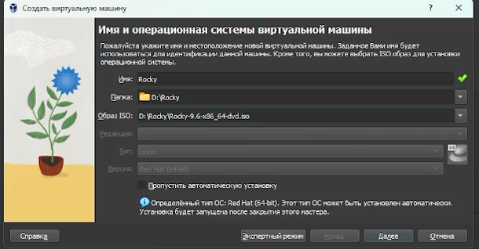
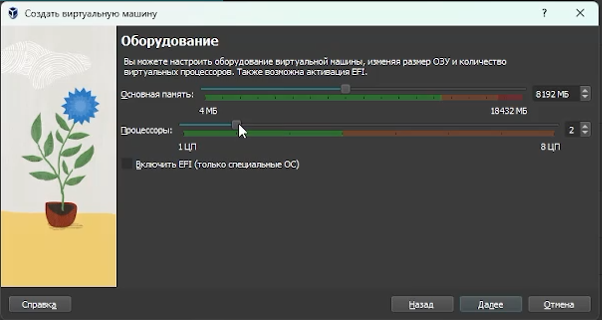
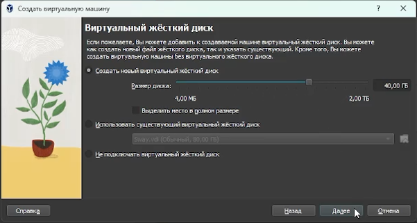
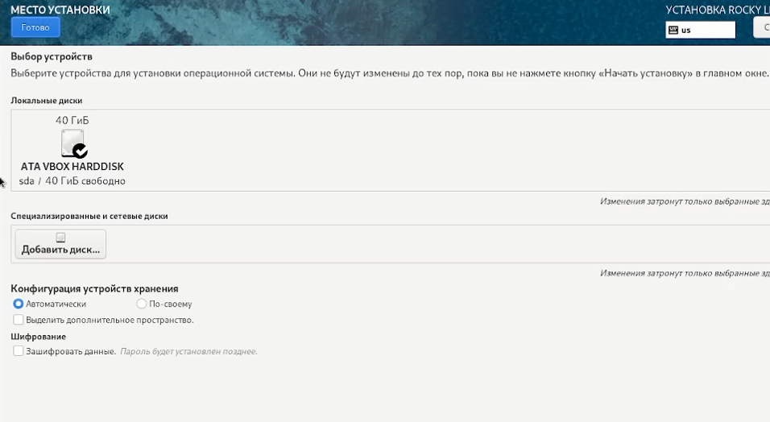
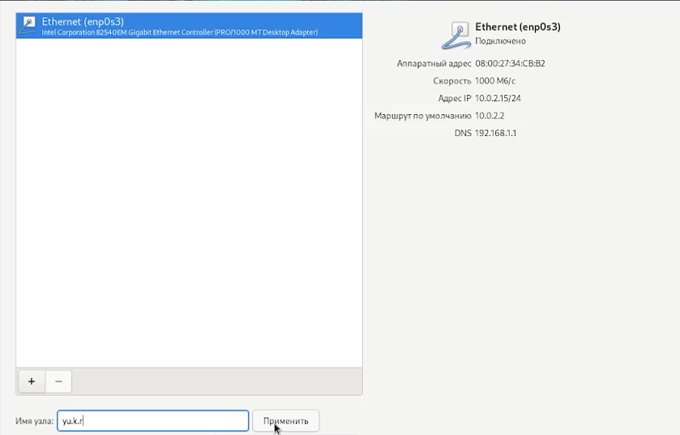
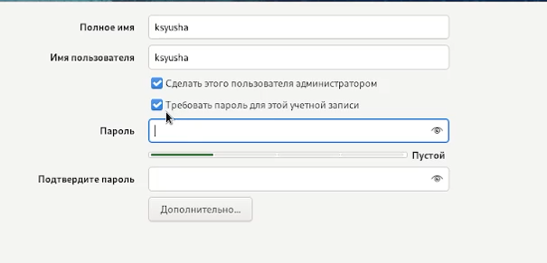
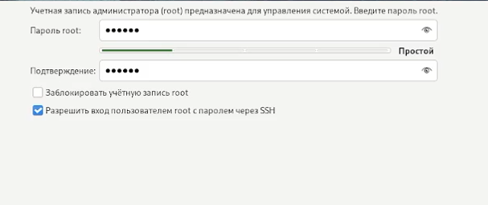
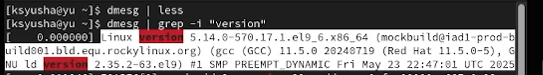
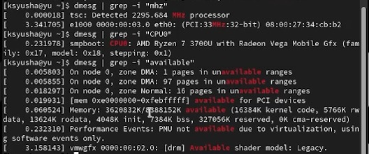
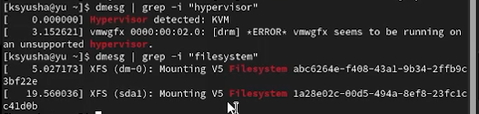

---
## Front matter
lang: ru-RU
title: Лабораторная работа №1
subtitle: Установка и конфигурация операционной системы на виртуальную машину
author:
  - Юсупова Ксения Равилевна
institute:
  - Российский университет дружбы народов, Москва, Россия

## i18n babel
babel-lang: russian
babel-otherlangs: english

## Formatting pdf
toc: false
toc-title: Содержание
slide_level: 2
aspectratio: 169
section-titles: true
theme: metropolis
header-includes:
 - \metroset{progressbar=frametitle,sectionpage=progressbar,numbering=fraction}
---

# Информация

## Докладчик

:::::::::::::: {.columns align=center}
::: {.column width="70%"}

  * Юсупова Ксения Равилевна
  * Российский университет дружбы народов
  * Номер студенческого билета- 1132247531
  * [1132247531@pfur.ru]

:::
::::::::::::::

# Вводная часть

## Цель работы

Целью данной работы является приобретение практических навыков установки операционной системы на виртуальную машину, настройки минимально необходимых для дальнейшей работы сервисов.

# Выполнение лабораторной работы

Сначала укажем имя и операционную систему для виртуальной машины 

{#fig:001 width=70%}

## Выполнение лабораторной работы

Выбрали 8192 МБ основной паямяти и 2 процеесора 

{#fig:002 width=70%}

## Выполнение лабораторной работы

Создали виртуальный жесткий диск размером 40 ГБ 

{#fig:003 width=70%}

## Выполнение лабораторной работы

Выбрали диск для устновки операционной системы 

{#fig:004 width=70%}

## Выполнение лабораторной работы

Настроили выбор сети 

{#fig:005 width=70%}

## Выполнение лабораторной работы

Настроили имя пользователя с правами администратора 

{#fig:006 width=70%}

## Выполнение лабораторной работы

Создали пароль администратора для root 

{#fig:007 width=70%}

## Выполнение домашнего задания

Для начала просмотрели на вывод этой команды: dmesg | less; затем получили информацию о версии ядра Linux 

{#fig:008 width=70%}

## Выполнение домашнего задания

Получили информацию о частоте процессора (Detected Mhz processor), модели процессора (CPU0) и объеме доступной оперативной памяти (Memory available)

{#fig:009 width=70%}

## Выполнение домашнего задания

Получили информацию о типе обнаруженного гипервизора (Hypervisor detected), типе файловой системы корневого раздела и последовательности монтирования файловых систем

{#fig:010 width=70%}

# Выводы

В ходе лабораторной работы мы  приобрели практические навыки установки операционной системы на виртуальную машину, настройки минимально необходимых для дальнейшей работы сервисов.

