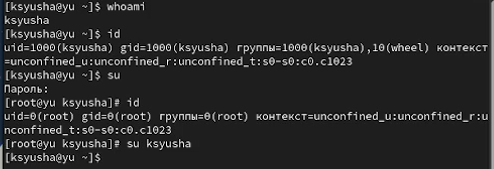
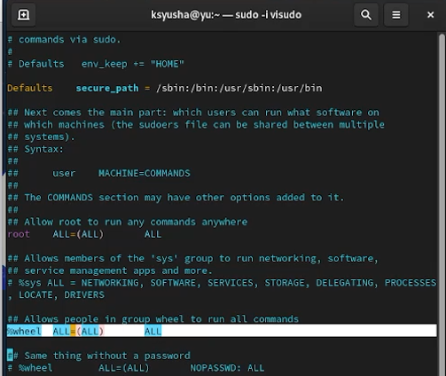
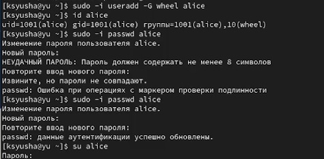
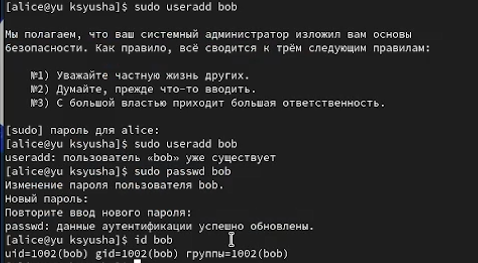
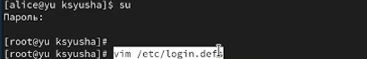
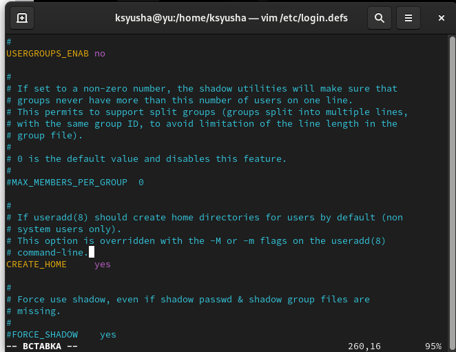
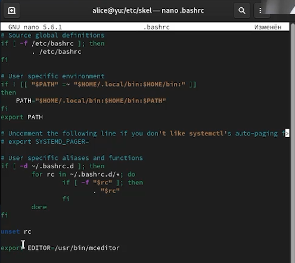
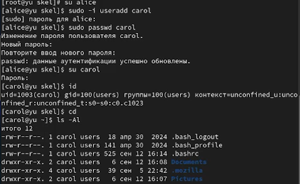
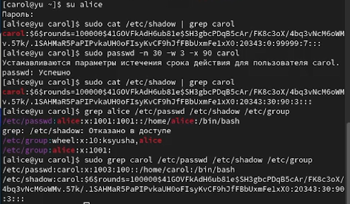
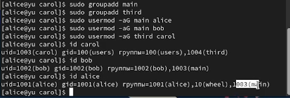

---
## Front matter
lang: ru-RU
title: Лабораторная работа №2
subtitle: Управление пользователями и группами
author:
  - Юсупова Ксения Равилевна
institute:
  - Российский университет дружбы народов, Москва, Россия

## i18n babel
babel-lang: russian
babel-otherlangs: english

## Formatting pdf
toc: false
toc-title: Содержание
slide_level: 2
aspectratio: 169
section-titles: true
theme: metropolis
header-includes:
 - \metroset{progressbar=frametitle,sectionpage=progressbar,numbering=fraction}
---

# Информация

## Докладчик

:::::::::::::: {.columns align=center}
::: {.column width="70%"}

  * Юсупова Ксения Равилевна
  * Российский университет дружбы народов
  * Номер студенческого билета- 1132247531
  * [1132247531@pfur.ru]

:::
::::::::::::::

# Цель работы

Получить представление о работе с учётными записями пользователей и группами пользователей в операционной системе типа Linux.

# Задание

1. Прочитайте справочное описание man по командам ls, whoami, id, groups, su, sudo, passwd, vi, visudo, useradd, usermod, userdel, groupadd, groupdel.

2. Выполните действия по переключению между учётными записями пользователей, поуправлению учётными записями пользователей (раздел 2.4.1).

3. Выполните действия по созданию пользователей и управлению их учётными записями(раздел 2.4.2).

4. Выполните действия по работе с группами пользователей (раздел 2.4.3).
 
# Выполнение лабораторной работы

Сначала вошли в систему как обычный пользователь и открыли терминал. Затем определили, какую учётную запись пользователя мы используем, введя команду `whoami`. Позже вывели на экран более подробную информацию, используя команду `id`. 
**Пояснения по отображённой информации:**
- `uid=1000 (ksyusha)`: работа под обычным пользователем с ID 1000
- `gid=1000 (ksyusha)`: основная группа пользователя — ksyusha (ID 1000)
- `группы=1000(ksyusha),10(wheel)`: пользователь состоит в своей группе и в привилегированной группе wheel
- `контекст=unconfined_u:unconfined_r:unconfined_t:s0-s0:c0.c1023`: политика SELinux в неограниченном режиме

{#fig:001 width=50%}

## Выполнение лабораторной работы

Далее использовали команду `su` для переключения к учётной записи root. Набрали `id`:
**Пояснения по отображённой информации:**
- `uid=0(root)`: суперпользователь root с ID 0
- `gid=0(root)`: основная группа — root (ID 0)
- `группы=0(root)`: пользователь root состоит только в группе root
- `контекст=unconfined_u:unconfined_r:unconfined_t:s0-s0:c0.c1023`: контекст SELinux без изменений

Затем вернулись к учётной записи своего пользователя.

{#fig:001 width=50%}

## Выполнение лабораторной работы

Просмотрели в безопасном режиме файл /etc/sudoers, используя, sudo -i visudo.

visudo используется вместо любого редактора, потому что он проверяет синтаксис перед сохранением. Ошибка в /etc/sudoers, допущенная в обычном редакторе, полностью отключает sudo, исправить её будет невозможно без доступа root другими способами. Например sudo EDITOR=mcedit visudo — меняет редактор, но сохраняет проверку синтаксиса. 

Убедились, что в открытом с помощью visudo файле присутствует строка %wheel ALL=(ALL) ALL 

{#fig:002 width=40%}

## Выполнение лабораторной работы

Создали пользователя alice, входящего в группу wheel:
sudo -i useradd -G wheel alice.
Убедились, что пользователь alice добавлен в группу wheel, введя id alice.
Задали пароль для пользователя alice, набрав sudo -i passwd alice. Позже переключились на учётную запись пользователя alice: su alice

{#fig:003 width=50%}

## Выполнение лабораторной работы

Создали пользователя bob: sudo useradd bob. Затем ввели пароль при запросе. Проверили, что пользователь bob создан. Установили пароль для пользователя bob: sudo passwd bob. Просмотрели, в какие группы входит пользователь bob: id bob

{#fig:004 width=50%}

## Выполнение лабораторной работы

Переключились в терминале на учётную запись пользователя root: su и открыли файл конфигурации /etc/login.defs 

## Выполнение лабораторной работы

Открыли `/etc/login.defs` для редактирования: `vim /etc/login.defs`. Установили `CREATE_HOME yes` и `USERGROUPS_ENAB no` для использования группы users по умолчанию.

## Выполнение лабораторной работы

Перешли в каталог `/etc/skel`: `cd /etc/skel`. Создали каталоги Pictures и Documents. Добавили в `.bashrc` строку `export EDITOR=/usr/bin/mceditor` для установки редактора по умолчанию.

## Выполнение лабораторной работы

Переключились на alice. Создали пользователя carol: `useradd carol`. Установили пароль. Убедились, что каталоги созданы в домашнем каталоге carol. Пользователь carol имеет базовые права для работы в своей домашней директории и с файлами, к которым у группы users есть доступ. Она не может повышать свои привилегии до root. Её основная группа — users (gid=100);

{#fig:008 width=50%}

## Выполнение лабораторной работы

Изменили свойства пароля carolс следующим образом: sudo passwd -n 30 -w 3 -x 90 carol. В этой записи срок действия пароля истекает через 90 дней (-x 90). За три дня до истечения срока действия пользователь получит предупреждение (-w 3). Убедились в изменении в строке с данными о пароле пользователя carol в файле
/etc/shadow . Убедились, что идентификатор alice существует во всех трёх файлах, и что идентификатор carol существует не во всех трёх файлах 

{#fig:009 width=50%}

## Выполнение лабораторной работы

Создали группы main и third. Добавили пользователей:
- alice и bob в main
- carol, dan, dave и david в third
Пользователю carol была назначена основная группа с идентификатором gid = 100 (users), а также он входит во вторичную группу third (GID=1004). Пользователь bob имеет основную группу bob (GID=1002) и входит во вторичную группу main (GID=1003). Пользователь alice, чья основная группа — alice (GID=1001), является участником двух вторичных групп: wheel (GID=10) и main (GID=1003). Только alice обладает административными полномочиями.

{#fig:010 width=50%}

# Выводы

В ходе лаборатоной работы мы получили представление о работе с учётными записями пользователей и группамипользователей в операционной системе типа Linux.

