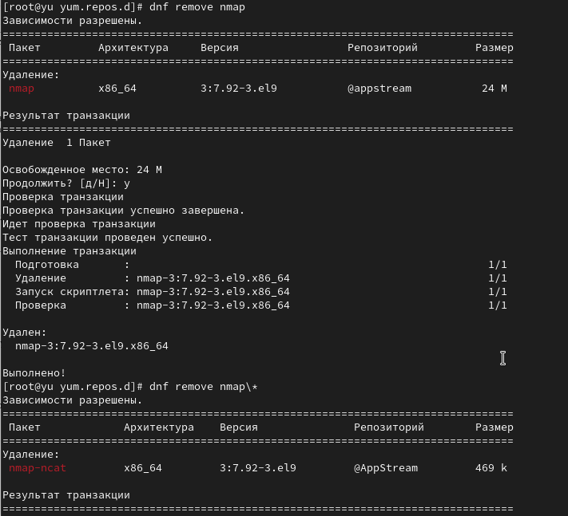

---
## Front matter
lang: ru-RU
title: Лабораторная работа №4
subtitle: Работа с программными пакетами
author:
  - Юсупова К. Р.
institute:
  - Российский университет дружбы народов, Москва, Россия

## i18n babel
babel-lang: russian
babel-otherlangs: english

## Formatting pdf
toc: false
toc-title: Содержание
slide_level: 2
aspectratio: 169
section-titles: true
theme: metropolis
header-includes:
 - \metroset{progressbar=frametitle,sectionpage=progressbar,numbering=fraction}
---

# Информация

## Докладчик

:::::::::::::: {.columns align=center}
::: {.column width="70%"}

  * Юсупова Ксения Равилевна
  * Российский университет дружбы народов
  * Номер студенческого билета- 1132247531
  * [1132247531@pfur.ru]

:::
::::::::::::::

# Вводная часть

## Цель работы

Получить навыки работы с репозиториями и менеджерами пакетов.

## Задание

1. Изучите, как и в каких файлах подключаются репозитории для установки программного обеспечения; изучите основные возможности (поиск, установка, обновление, удаление пакета, работа с историей действий) команды dnf (см. раздел 4.4.1).

2. Изучите и повторите процесс установки/удаления определённого пакета с использованием возможностей dnf (см. раздел 4.4.1).

3. Изучите и повторите процесс установки/удаления определённого пакета с использованием возможностей rpm (см. раздел 4.4.2)

# Выполнение лабораторной работы

В консоли перешли в режим работы суперпользователя и в каталог /etc/yum.repos.d; изучили содержание каталога и файлов репозиториев.

{#fig:001 width=70%}

## Выполнение лабораторной работы

Вывели на экран список репозиториев и список пакетов, в названии или описании которых есть слово use

{#fig:002 width=70%}

## Выполнение лабораторной работы

Установили nmap, предварительно изучив информацию по имеющимся пакетам. dnf install nmap — устанавливает только основной пакет nmap, а dnf install nmap* — устанавливает основной пакет nmap и все дополнительные пакеты, имена которых начинаются с "nmap"

{#fig:003 width=70%}

## Выполнение лабораторной работы

 Удалили nmap.

{#fig:004 width=70%}

## Выполнение лабораторной работы

Получили список имеющихся групп пакетов, затем установили группу пакетов RPM Development Tools.

{#fig:005 width=70%}

## Выполнение лабораторной работы

 Посмотрели историю использования команды dnf и отменили шестое по счёту, действие.

{#fig:006 width=70%}

## Выполнение лабораторной работы

Скачали rpm-пакет lynx и  нашли каталог, в который был помещён пакет после загрузки.

{#fig:007 width=70%}

## Выполнение лабораторной работы

Перешли в этот каталог и затем установили rpm-пакет; определили расположение исполняемого файла; и используя rpm, определили по имени файла, к какому пакету принадлежит lynx и получили дополнительную информацию о содержимом пакета.

{#fig:008 width=70%}

## Выполнение лабораторной работы

Получили список всех файлов в пакете, а также вывели перечень файлов с документацией пакета.

{#fig:009 width=70%}

## Выполнение лабораторной работы

Посмотрели файлы документации, применив команду man lynx; затем вывели на экран перечень и месторасположение конфигурационных файлов пакета и скриптов, выполняемых при установке пакета

{#fig:010 width=70%}

## Выполнение лабораторной работы

В отдельном терминале под своей учётной записью запустили текстовый браузер lynx, чтобы проверить корректность установки пакета. Вернулись в терминал с учётной записью root и удалите пакет, потом установили пакет dnsmasq

{#fig:011 width=70%}

## Выполнение лабораторной работы

Определили расположение исполняемого файла и определили по имени файла, к какому пакету принадлежит dnsmasq;и получили дополнительную информацию о содержимом пакета и список всех файлов в пакете, а также выведили перечень файлов с документацией пакет

{#fig:012 width=70%}

## Выполнение лабораторной работы

Вывели на экран перечень и месторасположение конфигурационных файлов пакета. Затем вывели на экран расположение и содержание скриптов, выполняемых при установке пакета. После вернулись в терминал с учётной записью root и удалили пакет

{#fig:013 width=70%}

# Выводы

В ходе лабораторной работы мы получили навыки работы с репозиториями и менеджерами пакетов.

