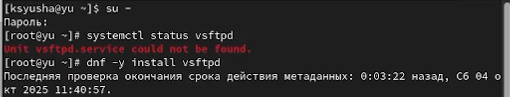
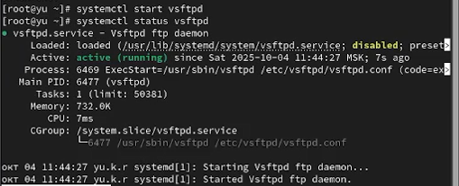
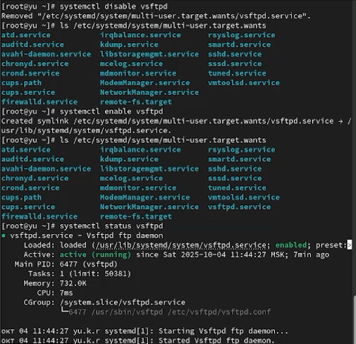
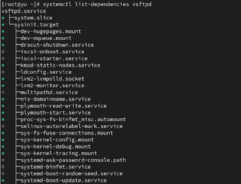
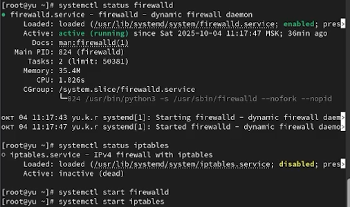
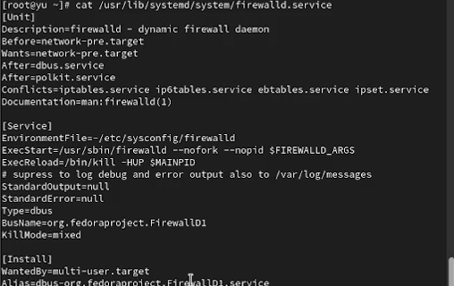
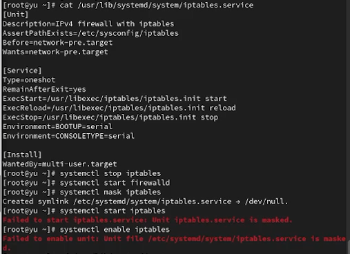
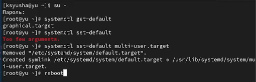
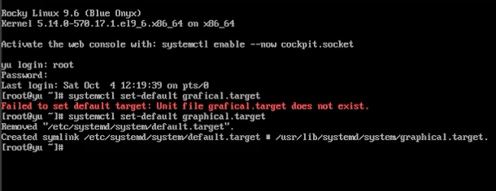

---
## Front matter
lang: ru-RU
title: Лабораторная работа №5
subtitle: Управление системными службами
author:
  - Юсупова К. Р.
institute:
  - Российский университет дружбы народов, Москва, Россия

## i18n babel
babel-lang: russian
babel-otherlangs: english

## Formatting pdf
toc: false
toc-title: Содержание
slide_level: 2
aspectratio: 169
section-titles: true
theme: metropolis
header-includes:
 - \metroset{progressbar=frametitle,sectionpage=progressbar,numbering=fraction}
---

# Информация

## Докладчик

:::::::::::::: {.columns align=center}
::: {.column width="70%"}

  * Юсупова Ксения Равилевна
  * Российский университет дружбы народов
  * Номер студенческого билета- 1132247531
  * [1132247531@pfur.ru]

:::
::::::::::::::

# Вводная часть

## Цель работы

Получить навыки управления системными службами операционной системы посредством systemd

# Выполнение лабораторной работы

Получили права администратора. Проверили статус службы Very Secure FTP - сервис отключён, так как не установлен. Установили службу 

{#fig:001 width=70%}

## Выполнение лабораторной работы

Запустили службу Very Secure FTP. Проверили статус - служба работает, но не активируется при перезагрузке ОС 

{#fig:002 width=70%}

## Выполнение лабораторной работы

Добавили службу в автозапуск командой systemctl enable. Проверили статус, затем удалили из автозапуска systemctl disable. Вывели символические ссылки - ссылка на vsftpd.service отсутствует. Снова добавили в автозапуск - создана символическая ссылка в /etc/systemd/system/multi-user.target.wants. Статус изменился с disabled на enabled 

{#fig:003 width=70%}

## Выполнение лабораторной работы

Вывели список зависимостей юнита 

{#fig:004 width=70%}

## Выполнение лабораторной работы

Вывели список юнитов, зависящих от данного. Установили iptables 

{#fig:005 width=70%}

## Выполнение лабораторной работы

Проверили статус firewalld и iptables. При запуске одной службы вторая деактивируется 

{#fig:006 width=70%}

## Выполнение лабораторной работы

В файле firewalld.service настроены конфликты с iptables.service, ip6tables.service, ebtables.service и ipset.service. Эти сервисы не могут работать одновременно с firewalld 

{#fig:007 width=70%}

## Выполнение лабораторной работы

Перешли в каталог systemd, нашли список изолируемых целей. Переключились в режим восстановления и перезагрузили ОС 

{#fig:008 width=70%}

## Выполнение лабораторной работы

Получили права администратора. Вывели цель по умолчанию. Установили текстовый режим по умолчанию и перезагрузили систему - ОС загрузилась в текстовом режиме (

{#fig:010 width=70%}

## Выполнение лабораторной работы

Установили графический режим по умолчанию и перезагрузили систему - ОС загрузилась в графическом режиме

{#fig:011 width=70%}

# Выводы

В ходе лабораторной работы мы получили навыки управления системными службами операционной системы посредством systemd.

