---
## Front matter
title: "Лабораторная работа №5"
subtitle: Управление системными службами
author: "Юсупова Ксения Равилевна"

## Generic otions
lang: ru-RU
toc-title: "Содержание"

## Bibliography
bibliography: bib/cite.bib
csl: pandoc/csl/gost-r-7-0-5-2008-numeric.csl

## Pdf output format
toc: true # Table of contents
toc-depth: 2
lof: true # List of figures
lot: true # List of tables
fontsize: 12pt
linestretch: 1.5
papersize: a4
documentclass: scrreprt
## I18n polyglossia
polyglossia-lang:
  name: russian
  options:
	- spelling=modern
	- babelshorthands=true
polyglossia-otherlangs:
  name: english
## I18n babel
babel-lang: russian
babel-otherlangs: english
## Fonts
mainfont: IBM Plex Serif
romanfont: IBM Plex Serif
sansfont: IBM Plex Sans
monofont: IBM Plex Mono
mathfont: STIX Two Math
mainfontoptions: Ligatures=Common,Ligatures=TeX,Scale=0.94
romanfontoptions: Ligatures=Common,Ligatures=TeX,Scale=0.94
sansfontoptions: Ligatures=Common,Ligatures=TeX,Scale=MatchLowercase,Scale=0.94
monofontoptions: Scale=MatchLowercase,Scale=0.94,FakeStretch=0.9
mathfontoptions:
## Biblatex
biblatex: true
biblio-style: "gost-numeric"
biblatexoptions:
  - parentracker=true
  - backend=biber
  - hyperref=auto
  - language=auto
  - autolang=other*
  - citestyle=gost-numeric
## Pandoc-crossref LaTeX customization
figureTitle: "Рис."
tableTitle: "Таблица"
listingTitle: "Листинг"
lofTitle: "Список иллюстраций"
lotTitle: "Список таблиц"
lolTitle: "Листинги"
## Misc options
indent: true
header-includes:
  - \usepackage{indentfirst}
  - \usepackage{float} # keep figures where there are in the text
  - \floatplacement{figure}{H} # keep figures where there are in the text
---

# Цель работы
 
Получить навыки управления системными службами операционной системы посредством systemd.

# Задание

1. Выполните основные операции по запуску (останову), определению статуса, добавлению (удалению) в автозапуск и пр. службы Very Secure FTP (раздел 5.4.1).

2. Продемонстрируйте навыки по разрешению конфликтов юнитов для служб firewalld и iptables (раздел 5.4.2).

3. Продемонстрируйте навыки работы с изолированными целями (разделы 5.4.3, 5.4.4).

# Выполнение лабораторной работы

Получили полномочия администратора; проверили статус службы Very Secure FTP, вывод команды должен показал, что сервис в настоящее время отключён, так как служба Very Secure FTP не установлена. Установили службу Very Secure FTP(рис. [-@fig:001]).

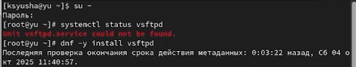{#fig:001 width=70%}

Запустили службу Very Secure FTP, проверили статус службы Very Secure FTP. Вывод команды должен показал, что служба в настоящее время работает, но не будет активирована при перезапуске операционной системы. (рис. [-@fig:002]).

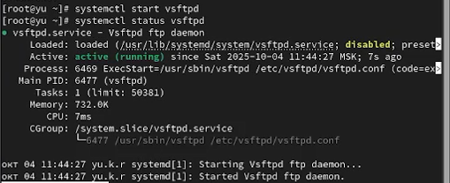{#fig:002 width=70%}

Добавили службу Very Secure FTP в автозапуск при загрузке операционной системы, используя команду systemctl enable. Затем проверили статус службы. Удалили службу из автозапуска, используя команду systemctl disable, и снова проверили её статус. Вывели на экран символические ссылки, ответственные за запуск различных сервисов, отобразилось, что ссылка на vsftpd.service не существует. Снова добавили службу Very Secure FTP в автозапуск и вывели на экран символические ссылки, ответственные за запуск различных
сервисов. Вывод команды показал, что создана символическая ссылка для файла /usr/lib/systemd/system/vsftpd.service в каталоге /etc/systemd/system/multi-user.target.wants. Снова проверили статус службы Very Secure FTP. Теперь увидели, что для файла юнита состояние изменено с disabled на enabled(рис. [-@fig:003]).

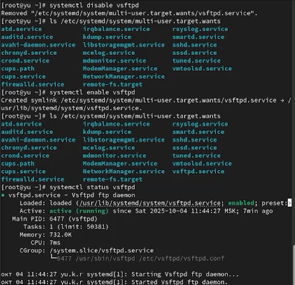{#fig:003 width=70%}

Вывели на экран список зависимостей юнита(рис. [-@fig:004]).

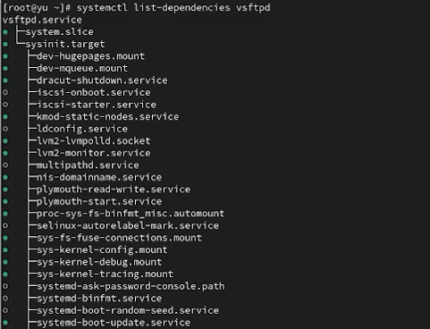{#fig:004 width=70%}

Вывели на экран список юнитов, которые зависят от данного юнита. Установили iptables([рис. @fig:005]).

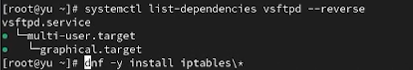{#fig:005 width=70%}

Проверили статус firewalld и iptables и попробовали запустить firewalld и iptables, увидели, что при запуске одной службы вторая дезактивируется ([рис. @fig:006]).

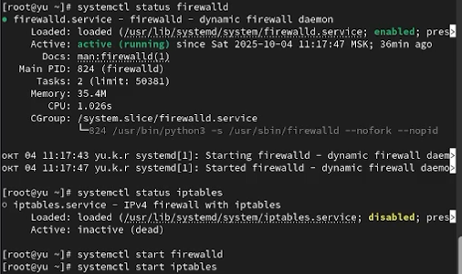{#fig:006 width=70%}

После введения команды увидели, что в файле сервиса firewalld.service настроены конфликты с iptables.service, ip6tables.service, ebtables.service и ipset.service. Данная директива означает, что эти сервисы не могут работать одновременно с firewalld. Это предотвращает конфликт за управление сетевым экраном и обеспечивает стабильность работы.([рис. @fig:007]).

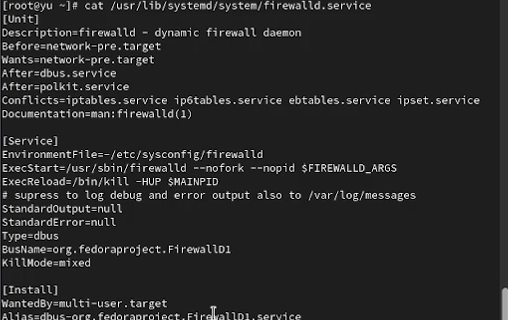{#fig:007 width=70%}

Перешли в каталог systemd и нашли список всех целей, которые можно изолировать. Переключили операционную систему в режим восстановления и  перезапустили операционную систему.([рис. @fig:008]).

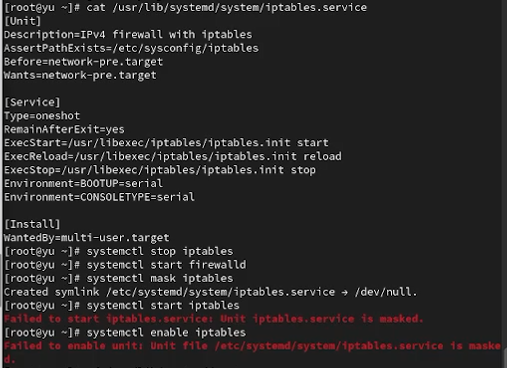{#fig:008 width=70%}

([рис. @fig:009]).

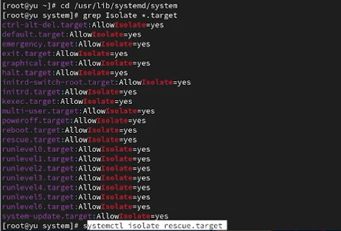{#fig:009 width=70%}

Получили полномочия администратора. Вывели на экран цель, установленную по умолчанию. Запустии по умолчанию текстовый режим и перегрузили систему командой reboot. Убедились, что система загрузилась в текстовом режиме. Получили полномочия администратора.([рис. @fig:010]).

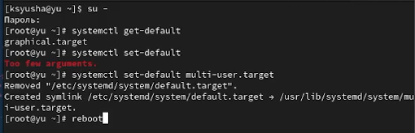{#fig:010 width=70%}

Запустили по умолчанию графический режим и вновь перегрузили систему командой reboot. Убедились, что система загрузилась в графическом режиме.([рис. @fig:011]).

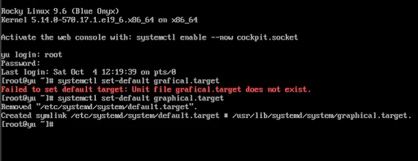{#fig:011 width=70%}

# Ответы на контрольные вопросы

1. В Rocky Linux юнит (unit) - это базовый объект systemd, представляющий сервисы (firewalld.service), цели (multi-user.target), точки монтирования или другие системные ресурсы.

2. В Rocky Linux команда `systemctl is-enabled <unit>` покажет статус автозагрузки, а `systemctl disable <unit>` отключит автозагрузку.

3. Для просмотра всех загруженных сервисных юнитов в Rocky Linux используется `systemctl list-units --type=service --state=loaded`.

4. В Rocky Linux потребность (wants) создается через создание симлинков в /etc/systemd/system/директория.wants/ или командой `systemctl enable`.

5. Для перехода в rescue target в Rocky Linux выполните `systemctl rescue` с правами root.

6. В Rocky Linux ошибка изоляции цели часто возникает с multi-user.target и graphical.target, так как они являются базовыми целями системы.

7. В Rocky Linux для детального просмотра зависимостей используйте `systemctl list-dependencies --reverse <service>`, чтобы увидеть, кто зависит от службы.

# Выводы

В ходе лабораторной работы мы получили навыки управления системными службами операционной системы посредством systemd.

