---
## Front matter
lang: ru-RU
title: Лабораторная работа №6
subtitle: Управление процессами
author:
  - Юсупова К. Р.
institute:
  - Российский университет дружбы народов, Москва, Россия

## i18n babel
babel-lang: russian
babel-otherlangs: english

## Formatting pdf
toc: false
toc-title: Содержание
slide_level: 2
aspectratio: 169
section-titles: true
theme: metropolis
header-includes:
 - \metroset{progressbar=frametitle,sectionpage=progressbar,numbering=fraction}
---

# Информация

## Докладчик

:::::::::::::: {.columns align=center}
::: {.column width="70%"}

  * Юсупова Ксения Равилевна
  * Российский университет дружбы народов
  * Номер студенческого билета- 1132247531
  * [1132247531@pfur.ru]

:::
::::::::::::::

# Вводная часть

## Цель работы

Получить навыки управления процессами операционной системы.

# Выполнение лабораторной работы

Получили права администратора. Запустили команду без &, получив контроль через 2 часа. Остановили процесс Ctrl+Z, продолжили в фоне bg 3. Проверили статус jobs. Вывели задания 1 и 2 на передний план fg 1, fg 2 и отменили их.

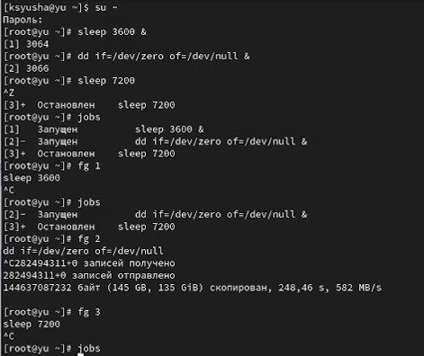{#fig:001 width=50%}

## Выполнение лабораторной работы

Открыли второй терминал и под учётной записью своего пользователя и ввели exit, чтобы закрыть второй терминал.

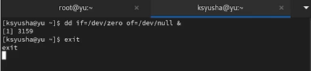{#fig:002 width=70%}

## Выполнение лабораторной работы

На другом терминале под учётной записью своего пользователя запустили top и увидели, что задание dd всё ещё запущено. Вновь запустили top и в нём использовали k , чтобы убить задание dd. После этого вышли из top.

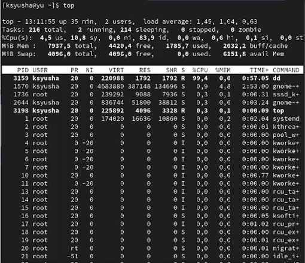{#fig:003 width=70%}

## Выполнение лабораторной работы

Получили полномочия администратора и ввели команды; увидели, что запущенные процессы dd идут
последними. Использовали PID одного из процессов dd, чтобы изменить приоритет.

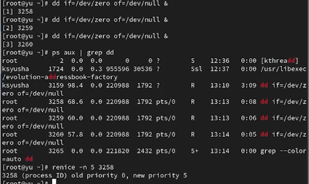{#fig:004 width=70%}

## Выполнение лабораторной работы

Команда с -B5 показывает строки до и после совпадения. ps fax отобразил иерархию процессов dd и оболочки. После закрытия корневой оболочки все процессы dd завершились 

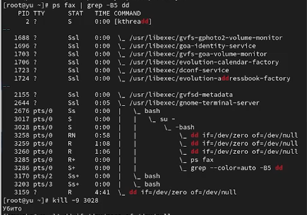{#fig:005 width=70%}

## Выполнение лабораторной работы

Запустили три dd в фоне. Изменили приоритет одного процесса на -5, затем на -15. Завершили все процессы dd 

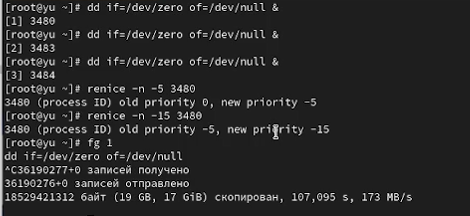{#fig:006 width=70%}

## Выполнение лабораторной работы

Запустили yes в фоне и на переднем плане с подавлением вывода. Приостановили и завершили программы. Повторили без подавления вывода 

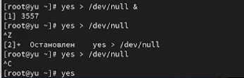{#fig:007 width=70%}

## Выполнение лабораторной работы

Проверили jobs, перевели процесс на передний план и остановили. Перевели процесс в фон, проверили статус. Запустили процесс с nohup для работы после закрытия терминала

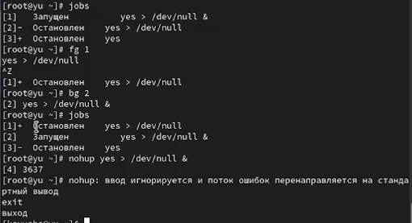{#fig:008 width=70%}

## Выполнение лабораторной работы

Получили информацию о запущенных в операционной системе процессах с помощью утилиты top.

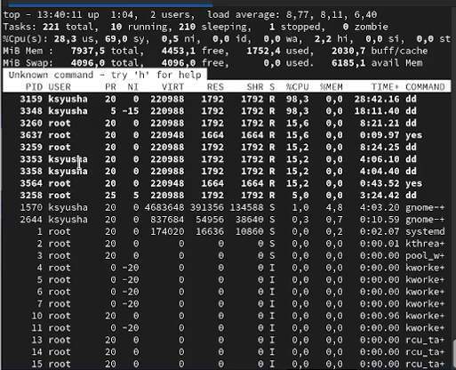{#fig:009 width=70%}

## Выполнение лабораторной работы

Запустили ещё три программы yes в фоновом режиме с подавлением потока вывода. Убили два процесса: для одного с помощью его PID, а для другого — его идентификатором конкретного задания. Послали сигнал 1 (SIGHUP) процессу, запущенному с помощью nohup, и обычному процессу.

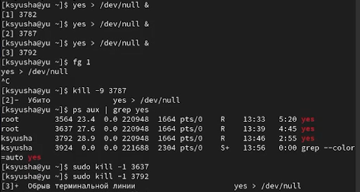{#fig:010 width=70%}

## Выполнение лабораторной работы

Запустили несколько yes в фоне. Завершили их killall. Запустили yes с разными приоритетами через nice. Выровняли приоритеты через renice

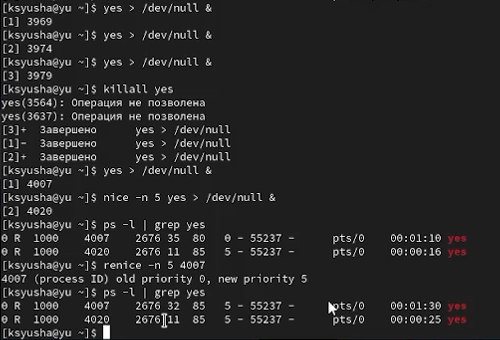{#fig:011 width=50%}

# Выводы

В ходе лабораторной работы мы получили навыки управления процессами операционной системы.

