---
## Front matter
title: "Лабораторная работа №6"
subtitle: Управление процессами
author: "Юсупова Ксения Равилевна"

## Generic otions
lang: ru-RU
toc-title: "Содержание"

## Bibliography
bibliography: bib/cite.bib
csl: pandoc/csl/gost-r-7-0-5-2008-numeric.csl

## Pdf output format
toc: true # Table of contents
toc-depth: 2
lof: true # List of figures
lot: true # List of tables
fontsize: 12pt
linestretch: 1.5
papersize: a4
documentclass: scrreprt
## I18n polyglossia
polyglossia-lang:
  name: russian
  options:
	- spelling=modern
	- babelshorthands=true
polyglossia-otherlangs:
  name: english
## I18n babel
babel-lang: russian
babel-otherlangs: english
## Fonts
mainfont: IBM Plex Serif
romanfont: IBM Plex Serif
sansfont: IBM Plex Sans
monofont: IBM Plex Mono
mathfont: STIX Two Math
mainfontoptions: Ligatures=Common,Ligatures=TeX,Scale=0.94
romanfontoptions: Ligatures=Common,Ligatures=TeX,Scale=0.94
sansfontoptions: Ligatures=Common,Ligatures=TeX,Scale=MatchLowercase,Scale=0.94
monofontoptions: Scale=MatchLowercase,Scale=0.94,FakeStretch=0.9
mathfontoptions:
## Biblatex
biblatex: true
biblio-style: "gost-numeric"
biblatexoptions:
  - parentracker=true
  - backend=biber
  - hyperref=auto
  - language=auto
  - autolang=other*
  - citestyle=gost-numeric
## Pandoc-crossref LaTeX customization
figureTitle: "Рис."
tableTitle: "Таблица"
listingTitle: "Листинг"
lofTitle: "Список иллюстраций"
lotTitle: "Список таблиц"
lolTitle: "Листинги"
## Misc options
indent: true
header-includes:
  - \usepackage{indentfirst}
  - \usepackage{float} # keep figures where there are in the text
  - \floatplacement{figure}{H} # keep figures where there are in the text
---

# Цель работы
 
Получить навыки управления процессами операционной системы.

# Задание
 
1. Продемонстрируйте навыки управления заданиями операционной системы (см. раздел 6.4.1).

2. Продемонстрируйте навыки управления процессами операционной системы (см. раздел 6.4.2).

3. Выполните задания для самостоятельной работы (см. раздел 6.5)

# Выполнение лабораторной работы

Получили полномочия администратора, ввели  команды и поскольку запустили последнюю команду без & после неё, у вас есть 2 часа, прежде чем вы снова получите контроль над оболочкой. Ввели Ctrl + z , чтобы остановить процесс и jobs, для продолжения выполнения задания 3 в фоновом режиме введите bg 3. С помощью команды jobs посмотрели изменения в статусе заданий. Для перемещения задания 1 на передний план ввели fg 1 и проделали то же самое для отмены заданий 2 и 3.(рис. [-@fig:001]).

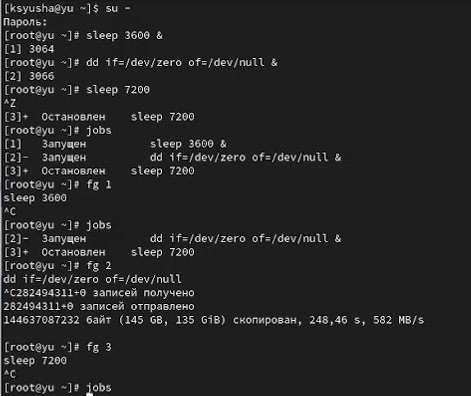{#fig:001 width=70%}

Открыли второй терминал и под учётной записью своего пользователя и ввели exit, чтобы закрыть второй терминал.(рис. [-@fig:002]).

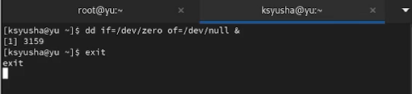{#fig:002 width=70%}

На другом терминале под учётной записью своего пользователя запустили top и увидели, что задание dd всё ещё запущено. Вновь запустили top и в нём использовали k , чтобы убить задание dd. После этого вышли из top.(рис. [-@fig:003]).

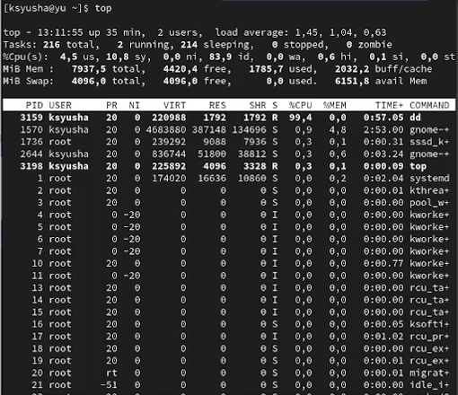{#fig:003 width=70%}

Получили полномочия администратора и ввели команды; увидели, что запущенные процессы dd идут
последними. Использовали PID одного из процессов dd, чтобы изменить приоритет.(рис. [-@fig:004]).

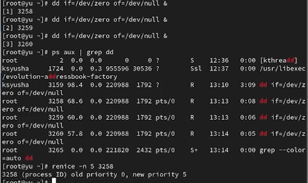{#fig:004 width=70%}

Введите команду, которая показала, что параметр -B5 показывает соответствующие запросу строки, включая пять строк до этого. Поскольку ps fax показывает иерархию отношений между процессами, также увидели оболочку, из которой были запущены все процессы dd, и её PID. Нашли PID корневой оболочки, из которой были запущены процессы dd, увидели, что корневая оболочка закрылась, а вместе с ней и все процессы dd.([рис. @fig:005]).

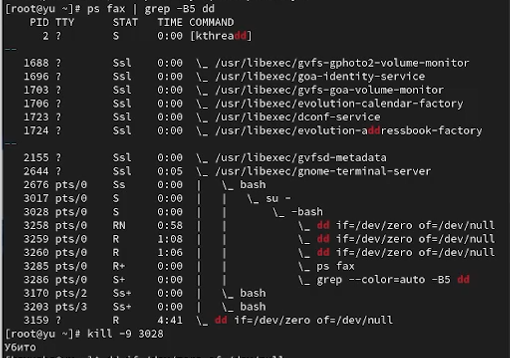{#fig:005 width=70%}

Запустите команду dd if=/dev/zero of=/dev/null трижды как фоновое задание. Изменили приоритет одной из этих команд, используя значение приоритета −5. Изменили приоритет того же процесса ещё раз, но используйте на этот раз значение −15. Завершили все процессы dd, которые запустили.([рис. @fig:006]).

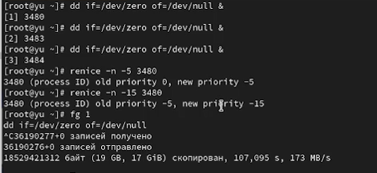{#fig:006 width=70%}

Запустили программу yes в фоновом режиме с подавлением потока вывода и программу yes на переднем плане с подавлением потока вывода. Приостановили выполнение программы. Заново запустили программу yes с теми же параметрами, затем завершили её выполнение. Затем запустили программу yes на переднем плане без подавления потока вывода. Приостановили выполнение программы. Заново запустите программу yes с теми же параметрами, затем завершили её выполнение.([рис. @fig:007]).

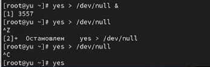{#fig:007 width=70%}

Проверили состояния заданий, воспользовавшись командой jobs, перевели процесс, который у вас выполняется в фоновом режиме, на передний план, затем остановите его. Перевели процесс с подавлением потока вывода в фоновый режим и проверили состояния заданий, воспользовавшись командой jobs. Обратили внимание, что процесс стал выполняющимся (Running) в фоновом режиме. Запустили процесс в фоновом режиме таким образом, чтобы он продолжил свою работу даже после отключения от терминала. Закрыли окно и заново запустили консоль. Убелись, что процесс продолжил свою работу.([рис. @fig:008]).

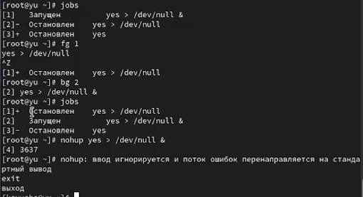{#fig:008 width=70%}

Получили информацию о запущенных в операционной системе процессах с помощью утилиты top.([рис. @fig:009]).

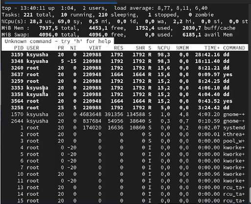{#fig:009 width=70%}

Запустили ещё три программы yes в фоновом режиме с подавлением потока вывода. Убили два процесса: для одного с помощью его PID, а для другого — его идентификатором конкретного задания. Послали сигнал 1 (SIGHUP) процессу, запущенному с помощью nohup, и обычному процессу.([рис. @fig:010]).

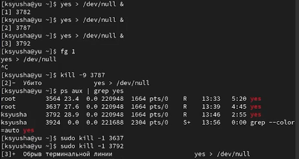{#fig:010 width=70%}

Запустили ещё несколько программ yes в фоновом режиме с подавлением потока вывода. Завершили их работу одновременно, используя команду killall. Запустили программу yes в фоновом режиме с подавлением потока вывода. Используя утилиту nice, запустили программу yes с теми же параметрами и с приоритетом, большим на 5. Сравнили абсолютные и относительные приоритеты у этих двух процессов. Используя утилиту renice, изменили приоритет у одного из потоков yes таким образом, чтобы у обоих потоков приоритеты были равны.([рис. @fig:011]).

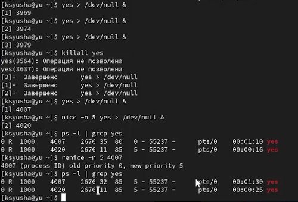{#fig:011 width=70%}

# Ответы на контрольные вопросы

1. Команда `jobs` показывает все текущие задания оболочки.

2. Остановить задание для фонового выполнения можно комбинацией Ctrl+Z.

3. Для отмены текущего задания оболочки используется комбинация Ctrl+C.

4. Если нет доступа к оболочке, задание можно отменить командой `kill` с идентификатором процесса.

5. Команда `pstree` отображает отношения между родительскими и дочерними процессами.

6. Изменить приоритет процесса 1234 на более высокий можно командой `renice -n -5 1234`.

7. Чтобы остановить все 20 процессов dd, проще всего использовать `killall dd`.

8. Остановить команду mycommand можно командой `pkill mycommand`.

9. В утилите `top` для завершения процесса используется клавиша 'k'.

10. Для запуска команды с высоким приоритетом без риска для системы используется `nice -n -10 command`.

# Выводы

В ходе лабораторной работы мы получили навыки управления процессами операционной системы.

