---
## Front matter
lang: ru-RU
title: Лабораторная работа №7
subtitle: Управление журналами событий в системе
author:
  - Юсупова К. Р.
institute:
  - Российский университет дружбы народов, Москва, Россия

## i18n babel
babel-lang: russian
babel-otherlangs: english

## Formatting pdf
toc: false
toc-title: Содержание
slide_level: 2
aspectratio: 169
section-titles: true
theme: metropolis
header-includes:
 - \metroset{progressbar=frametitle,sectionpage=progressbar,numbering=fraction}
---

# Информация

## Докладчик

:::::::::::::: {.columns align=center}
::: {.column width="70%"}

  * Юсупова Ксения Равилевна
  * Российский университет дружбы народов
  * Номер студенческого билета- 1132247531
  * [1132247531@pfur.ru]

:::
::::::::::::::

# Вводная часть

## Цель работы

Получить навыки работы с журналами мониторинга различных событий в системе.

# Выполнение лабораторной работы

Запустили три вкладки терминала с правами администратора. Во второй вкладке начали мониторинг системных событий, затем остановили его Ctrl+C и запустили просмотр сообщений безопасности

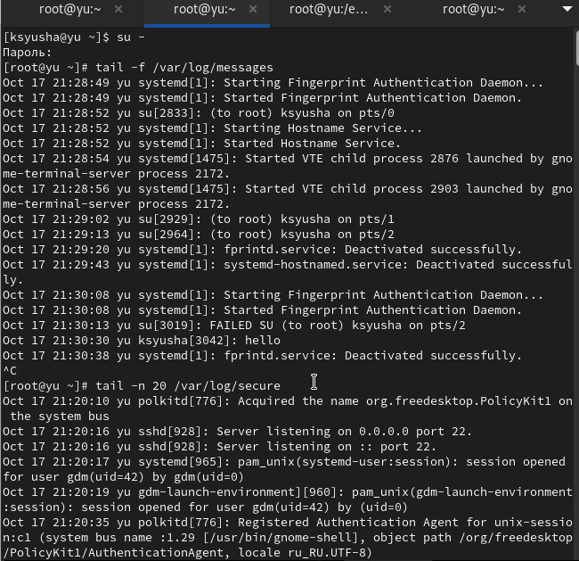{#fig:001 width=70%}

## Выполнение лабораторной работы

В третьей вкладке вернулись к учётной записи пользователя и ввели неверный пароль root. Во второй вкладке появилось сообщение о failed su, затем ввели logger hello

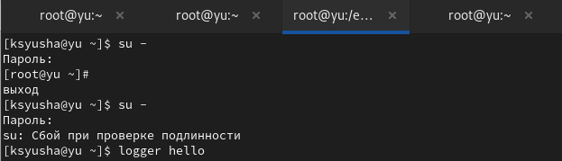{#fig:002 width=70%}

## Выполнение лабораторной работы

В первой вкладке установили и запустили веб-сервер Apache 

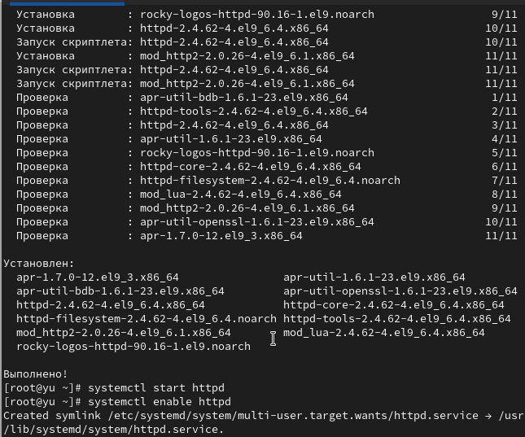{#fig:003 width=70%}

## Выполнение лабораторной работы

Во второй вкладке просмотрели журнал ошибок веб-службы

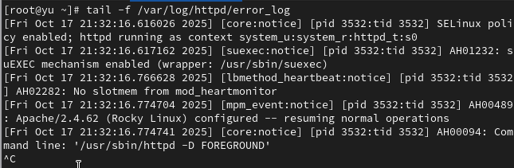{#fig:004 width=70%}

## Выполнение лабораторной работы

В третьей вкладке настроили логирование ошибок Apache через syslog, создали конфигурационные файлы для мониторинга и отладки 

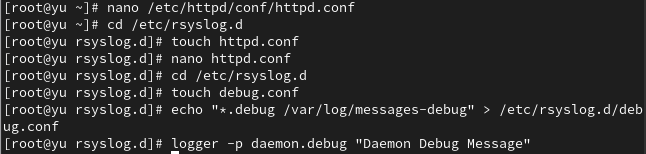{#fig:005 width=70%}

## Выполнение лабораторной работы

В первой вкладке перезагрузили конфигурацию rsyslogd и веб-службы 

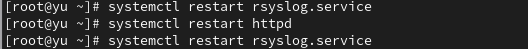{#fig:006 width=70%}

## Выполнение лабораторной работы

Во второй вкладке запустили мониторинг отладочной информации и просмотрели debug-сообщения 

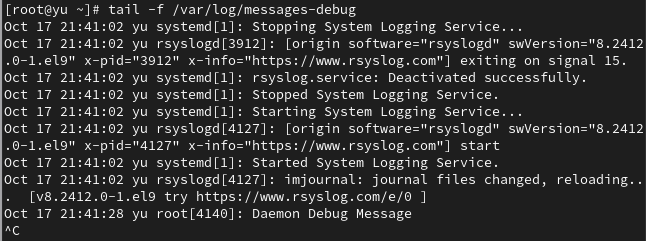{#fig:007 width=70%}

## Выполнение лабораторной работы

Просмотрели журнал событий с последнего запуска системы и содержимое журнала без пейджера 

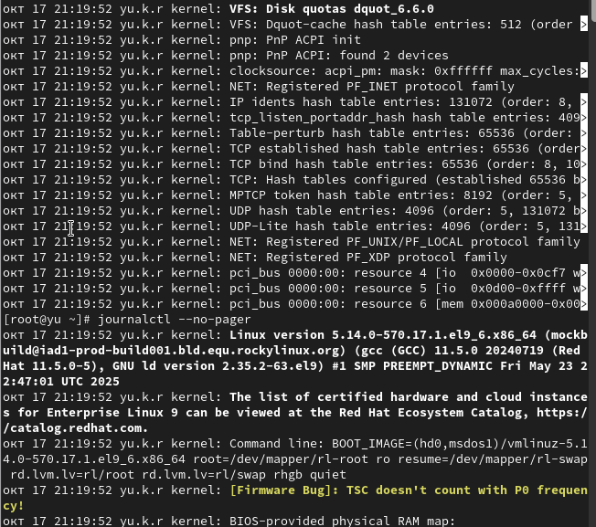{#fig:008 width=70%}

## Выполнение лабораторной работы

Запустили просмотр журнала в реальном времени и изучили доступные параметры фильтрации 

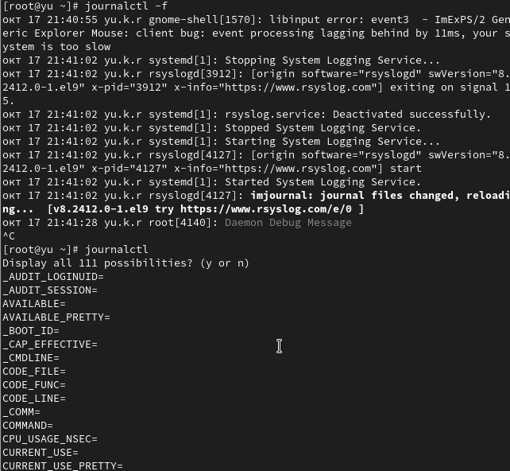{#fig:009 width=70%}

## Выполнение лабораторной работы

Просмотрели события для UID 0, последние 20 строк журнала и сообщения об ошибках

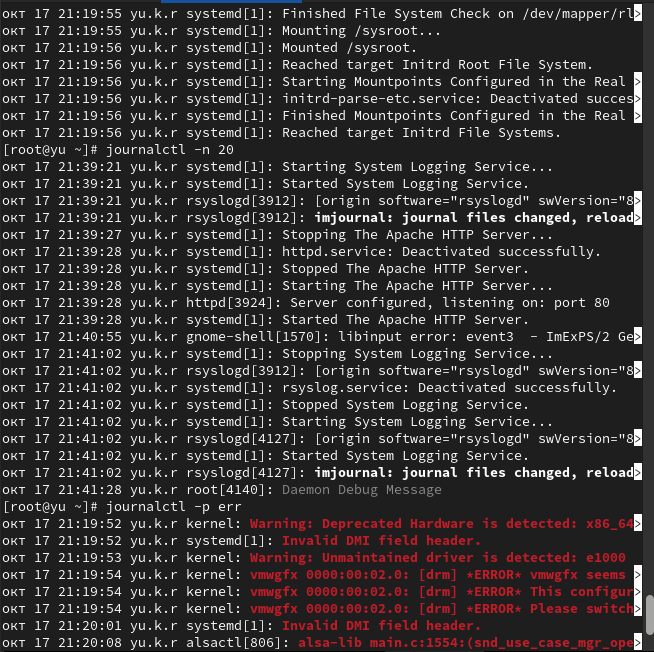{#fig:010 width=70%}

## Выполнение лабораторной работы

Просмотрели сообщения со вчерашнего дня, ошибки за этот период, детальную информацию и логи sshd 

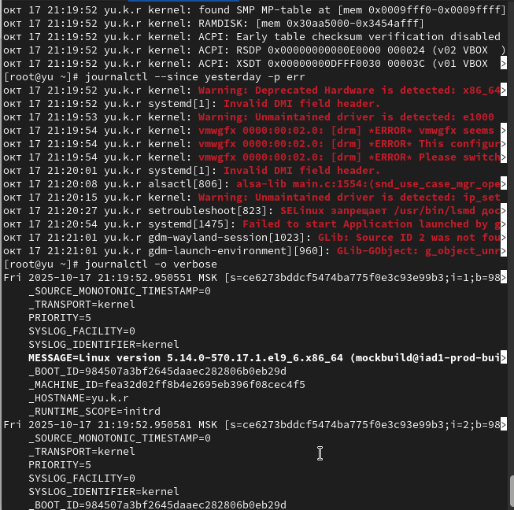{#fig:011 width=70%}

## Выполнение лабораторной работы

Создали каталог для постоянного хранения журналов, настроили права и активировали постоянное хранение journald 

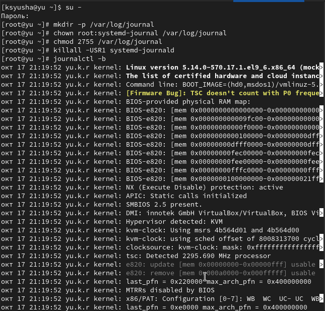{#fig:012 width=70%}

# Выводы

В ходе лабораторной работы мы получили навыки работы с журналами мониторинга различных событий в системе.

