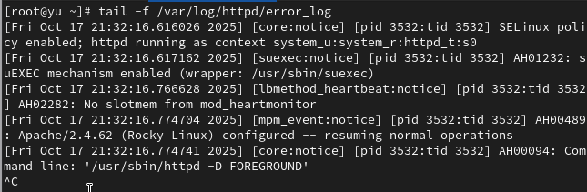

---
## Front matter
title: "Лабораторная работа №7"
subtitle: Управление журналами событий в системе
author: "Юсупова Ксения Равилевна"

## Generic otions
lang: ru-RU
toc-title: "Содержание"

## Bibliography
bibliography: bib/cite.bib
csl: pandoc/csl/gost-r-7-0-5-2008-numeric.csl

## Pdf output format
toc: true # Table of contents
toc-depth: 2
lof: true # List of figures
lot: true # List of tables
fontsize: 12pt
linestretch: 1.5
papersize: a4
documentclass: scrreprt
## I18n polyglossia
polyglossia-lang:
  name: russian
  options:
	- spelling=modern
	- babelshorthands=true
polyglossia-otherlangs:
  name: english
## I18n babel
babel-lang: russian
babel-otherlangs: english
## Fonts
mainfont: IBM Plex Serif
romanfont: IBM Plex Serif
sansfont: IBM Plex Sans
monofont: IBM Plex Mono
mathfont: STIX Two Math
mainfontoptions: Ligatures=Common,Ligatures=TeX,Scale=0.94
romanfontoptions: Ligatures=Common,Ligatures=TeX,Scale=0.94
sansfontoptions: Ligatures=Common,Ligatures=TeX,Scale=MatchLowercase,Scale=0.94
monofontoptions: Scale=MatchLowercase,Scale=0.94,FakeStretch=0.9
mathfontoptions:
## Biblatex
biblatex: true
biblio-style: "gost-numeric"
biblatexoptions:
  - parentracker=true
  - backend=biber
  - hyperref=auto
  - language=auto
  - autolang=other*
  - citestyle=gost-numeric
## Pandoc-crossref LaTeX customization
figureTitle: "Рис."
tableTitle: "Таблица"
listingTitle: "Листинг"
lofTitle: "Список иллюстраций"
lotTitle: "Список таблиц"
lolTitle: "Листинги"
## Misc options
indent: true
header-includes:
  - \usepackage{indentfirst}
  - \usepackage{float} # keep figures where there are in the text
  - \floatplacement{figure}{H} # keep figures where there are in the text
---

# Цель работы
 
Получить навыки работы с журналами мониторинга различных событий в системе.

# Задание
 
1. Продемонстрируйте навыки работы с журналом мониторинга событий в реальном времени (см. раздел 7.4.1).

2. Продемонстрируйте навыки создания и настройки отдельного файла конфигурации мониторинга отслеживания событий веб-службы (см. раздел 7.4.2).

3. Продемонстрируйте навыки работы с journalctl (см. раздел 7.4.3).

4. Продемонстрируйте навыки работы с journald (см. раздел 7.4.4).

# Выполнение лабораторной работы

Запустили три вкладки терминала и в каждом из них получите полномочия администратора. На второй вкладке терминала запустили мониторинг системных событий в реальном времени, позже также во второй вкладке терминала с мониторингом остановили трассировку файла сообщений мониторинга реального времени, используя Ctrl + c . Затем запустили мониторинг сообщений безопасности (последние 20 строк соответствующего файла)(рис. [-@fig:001]).

{#fig:001 width=70%}

В третьей вкладке терминала вернулись к учётной записи своего пользователя (достаточно нажать Ctrl + d ) и попробовали получить полномочия администратора, но ввели неправильный пароль. Обратили внимание, что во второй вкладке терминала с мониторингом событий или ничего не отобразится, или появится сообщение "FAILED SU (to root) username ...", затем ввели logger hello (рис. [-@fig:002]).

{#fig:002 width=70%}

В первой вкладке терминала установили Apache, после окончания процесса установки запустили веб-службу(рис. [-@fig:003]).

{#fig:003 width=70%}

о второй вкладке терминала посмотрели журнал сообщений об ошибках веб-службы(рис. [-@fig:004]).

{#fig:004 width=70%}

В третьей вкладке терминала получили полномочия администратора и в файле конфигурации /etc/httpd/conf/httpd.conf в конце добавьте следующую строку: ErrorLog syslog:local1. Здесь local0 — local7 — это «настраиваемые» средства (объекты), которые syslog предоставляет пользователю для регистрации событий приложения в системном журнале. В каталоге /etc/rsyslog.d создали файл мониторинга событий веб-службы.  Открыв его на редактирование, прописали в нём local1.* -/var/log/httpd-error.log . Эта строка позволит отправлять все сообщения, получаемые для объекта local1. Позже создали отдельный файл конфигурации для мониторинга отладочной информации. В этом же терминале ввели
echo "*.debug /var/log/messages-debug" > /etc/rsyslog.d/debug.conf и logger -p daemon.debug "Daemon Debug Message([рис. @fig:005]).

{#fig:005 width=70%}

Перешли в первую вкладку терминала и перезагрузили конфигурацию rsyslogd и веб-службу, позже снова перезапустили rsyslogd([рис. @fig:006]).

{#fig:006 width=70%}

Во второй вкладке терминала запустили мониторинг отладочной информации, позже посмотрели сообщение отладки.([рис. @fig:007]).

{#fig:007 width=70%}

Во второй вкладке терминала посмотрели содержимое журнала с событиями с момента последнего запуска системы и содержимого журнала без использования пейджера([рис. @fig:008]).

{#fig:008 width=70%}

Посмотрели режим просмотра журнала в реальном времени. Для использования фильтрации просмотра конкретных параметров журнала ввели journalctl и дважды нажмите клавишу Tab([рис. @fig:009]).

{#fig:009 width=70%}

Просмотрели события для UID0. Для отображения последних 20 строк журнала ввели journalctl -n 20 и для просмотра только сообщений об ошибках journalctl -p err([рис. @fig:010]).

{#fig:010 width=70%}

Для просмотра всех сообщений со вчерашнего дня ввели journalctl --since yesterday, чтобы показать все сообщения с ошибкой приоритета, которые были зафиксированы со вчерашнего дня, то использовали
journalctl --since yesterday -p err, для детальной информации ввели journalctl -o verbose, для просмотра дополнительной информации о модуле sshd ввели journalctl _SYSTEMD_UNIT=sshd.service([рис. @fig:011]).

{#fig:011 width=70%}

Запустили терминал и получили полномочия администратора.
Создали каталог для хранения записей журнала, скорректировали права доступа для каталога /var/log/journal, чтобы journald смог записывать в него информацию. Для принятия изменений необходимо или перезагрузить систему (перезапустить службу systemd-journald недостаточно), или использовать команду: killall -USR1 systemd-journald. Журнал systemd теперь постоянный, чтобы видеть сообщения журнала с момента последней перезагрузки journalctl -b([рис. @fig:012]).

{#fig:012 width=70%}

# Ответы на контрольные вопросы

1. Для настройки rsyslogd используется файл /etc/rsyslog.conf.

2. Сообщения, связанные с аутентификацией, содержатся в файле /var/log/secure.

3. Без дополнительной настройки ротация файлов журналов выполняется еженедельно.

4. Для записи сообщений с приоритетом info в файл /var/log/messages.info следует добавить строку: *.info /var/log/messages.info

5. Команда tail -f /var/log/messages позволяет просматривать сообщения журнала в реальном времени.

6. Команда journalctl _PID=1 --since "09:00" --until "15:00" показывает сообщения для PID 1 за указанный период.

7. Команда journalctl -b отображает сообщения journald с последней перезагрузки системы.

8. Для создания постоянного журнала journald необходимо создать директорию /var/log/journal и перезапустить службу systemd-journald.

# Выводы

В ходе лабораторной работы мы получили навыки работы с журналами мониторинга различных событий в системе.

