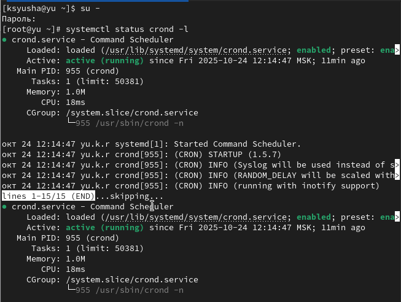
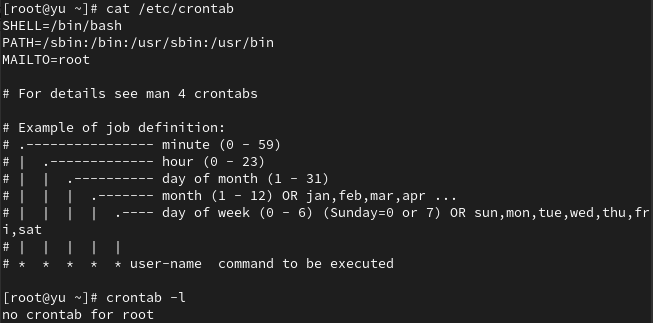
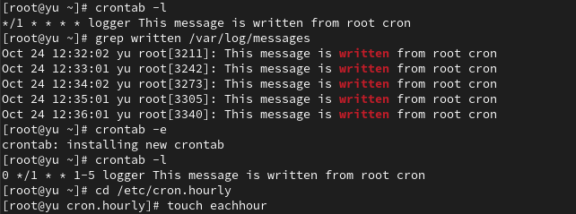
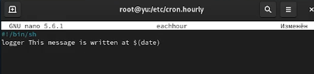
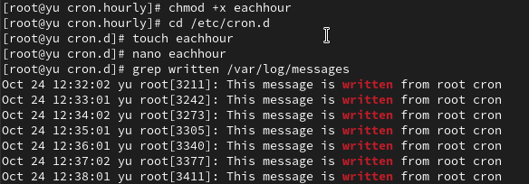
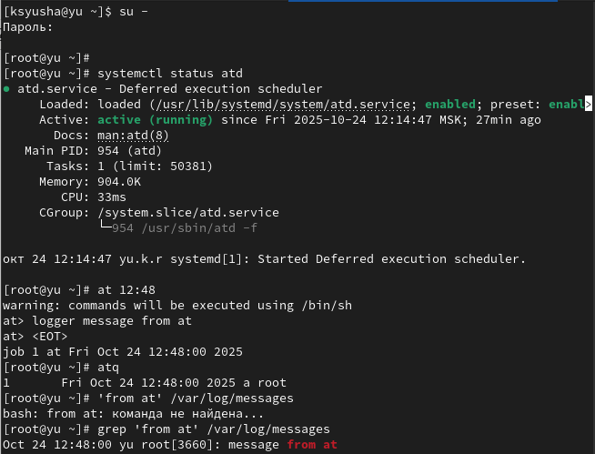

---
## Front matter
lang: ru-RU
title: Лабораторная работа №8
subtitle: Планировщики событий
author:
  - Юсупова К. Р.
institute:
  - Российский университет дружбы народов, Москва, Россия

## i18n babel
babel-lang: russian
babel-otherlangs: english

## Formatting pdf
toc: false
toc-title: Содержание
slide_level: 2
aspectratio: 169
section-titles: true
theme: metropolis
header-includes:
 - \metroset{progressbar=frametitle,sectionpage=progressbar,numbering=fraction}
---

# Информация

## Докладчик

:::::::::::::: {.columns align=center}
::: {.column width="70%"}

  * Юсупова Ксения Равилевна
  * Российский университет дружбы народов
  * Номер студенческого билета- 1132247531
  * [1132247531@pfur.ru]

:::
::::::::::::::

# Вводная часть

## Цель работы

Получение навыков работы с планировщиками событий cron и at.

# Выполнение лабораторной работы

Запустили терминал и получили полномочия администратора, посмотрели статус crond

{#fig:001 width=70%}

## Выполнение лабораторной работы

Посмотрели содержимое файла конфигурации /etc/crontab:
cat /etc/crontab и список заданий в расписании. Ничего не отобразилось, так как расписание ещё не задано.

{#fig:002 width=70%}

## Выполнение лабораторной работы

Открыли файл расписания на редактирование. Добавили данную нам строку в файл расписания (запись сообщения в системный журнал). Данное задание будет выполняться каждую минуту и записывать указанное сообщение в системный журнал.

{#fig:003 width=70%}

## Выполнение лабораторной работы

Проверили список заданий - появилась новая запись. Через 2-3 минуты убедились в работе задания по журналу. Изменили расписание на выполнение каждый час с понедельника по пятницу. Создали файл сценария в /etc/cron.hourly 

{#fig:004 width=70%}

## Выполнение лабораторной работы

Открыли файл eachhour для редактирования и прописали в нём скрипт (запись сообщения в системный журнал)

{#fig:005 width=70%}

## Выполнение лабораторной работы

Сделали файл исполняемым. Создали файл расписания в /etc/cron.d. Через 2-3 часа проверили журнал - сценарий выполнился по расписанию 

{#fig:006 width=70%}

## Выполнение лабораторной работы

Открыли файл eachhour для редактирования и поместили в него содержимое. Данное задание будет выполняться ежечасно в 11 минут каждого часа и записывать указанное сообщение в системный журнал от имени пользователя root.

{#fig:007 width=70%}

## Выполнение лабораторной работы

Получили права администратора. Проверили службу atd, запланировали задание на 12:48. Убедились в выполнении по записям в журнале

{#fig:008 width=70%}

# Выводы

В ходе лабораторной работы мы получили навыки работы с планировщиками событий cron и at

