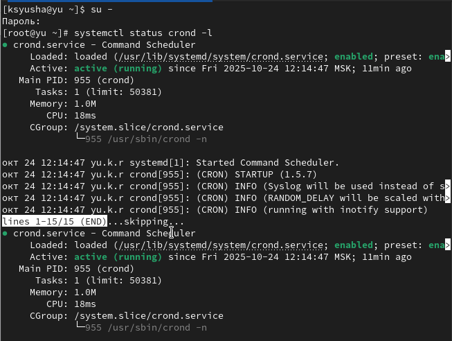
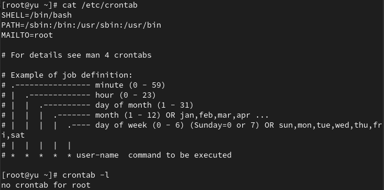
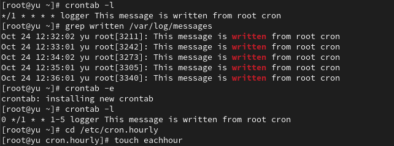
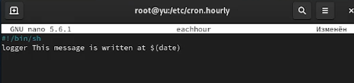
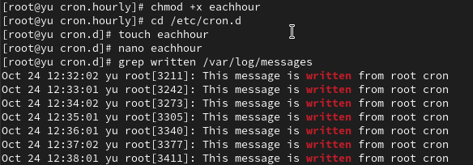
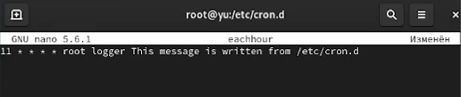
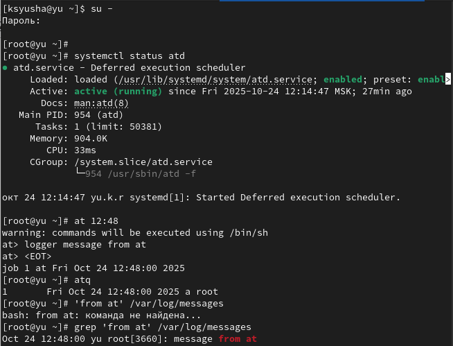

---
## Front matter
title: "Лабораторная работа №8"
subtitle: Планировщики событий
author: "Юсупова Ксения Равилевна"

## Generic otions
lang: ru-RU
toc-title: "Содержание"

## Bibliography
bibliography: bib/cite.bib
csl: pandoc/csl/gost-r-7-0-5-2008-numeric.csl

## Pdf output format
toc: true # Table of contents
toc-depth: 2
lof: true # List of figures
lot: true # List of tables
fontsize: 12pt
linestretch: 1.5
papersize: a4
documentclass: scrreprt
## I18n polyglossia
polyglossia-lang:
  name: russian
  options:
	- spelling=modern
	- babelshorthands=true
polyglossia-otherlangs:
  name: english
## I18n babel
babel-lang: russian
babel-otherlangs: english
## Fonts
mainfont: IBM Plex Serif
romanfont: IBM Plex Serif
sansfont: IBM Plex Sans
monofont: IBM Plex Mono
mathfont: STIX Two Math
mainfontoptions: Ligatures=Common,Ligatures=TeX,Scale=0.94
romanfontoptions: Ligatures=Common,Ligatures=TeX,Scale=0.94
sansfontoptions: Ligatures=Common,Ligatures=TeX,Scale=MatchLowercase,Scale=0.94
monofontoptions: Scale=MatchLowercase,Scale=0.94,FakeStretch=0.9
mathfontoptions:
## Biblatex
biblatex: true
biblio-style: "gost-numeric"
biblatexoptions:
  - parentracker=true
  - backend=biber
  - hyperref=auto
  - language=auto
  - autolang=other*
  - citestyle=gost-numeric
## Pandoc-crossref LaTeX customization
figureTitle: "Рис."
tableTitle: "Таблица"
listingTitle: "Листинг"
lofTitle: "Список иллюстраций"
lotTitle: "Список таблиц"
lolTitle: "Листинги"
## Misc options
indent: true
header-includes:
  - \usepackage{indentfirst}
  - \usepackage{float} # keep figures where there are in the text
  - \floatplacement{figure}{H} # keep figures where there are in the text
---

# Цель работы
 
Получение навыков работы с планировщиками событий cron и at.

# Задание
 
1. Выполните задания по планированию задач с помощью crond (см. раздел 8.4.1).

2. Выполните задания по планированию задач с помощью atd (см. раздел 8.4.2).

# Выполнение лабораторной работы

Запустили терминал и получили полномочия администратора, посмотрели статус crond(рис. [-@fig:001]).

{#fig:001 width=70%}

Посмотрели содержимое файла конфигурации /etc/crontab:
cat /etc/crontab и список заданий в расписании. Ничего не отобразилось, так как расписание ещё не задано.(рис. [-@fig:002]).

{#fig:002 width=70%}

Открыли файл расписания на редактирование. Добавили данную нам строку в файл расписания (запись сообщения в системный журнал). Данное задание будет выполняться каждую минуту и записывать указанное сообщение в системный журнал.[-@fig:003]).

{#fig:003 width=70%}

Посмотрели список заданий в расписании. В расписании появилась запись о запланированном событии. Не выключая систему, через некоторое время (2–3 минуты) просмотрели журнал системных событий. Задание будет выполнялось каждую минуту и записывало указанное сообщение в системный журнал. Позже изменили запись в расписании crontab на следующую. Данное задание будет выполняться в 0 минут каждого часа, но только с понедельника по пятницу, и записывать указанное сообщение в системный журнал. Посмотрели список заданий в расписании и перешли в каталог /etc/cron.hourly и создали в нём файл сценария с именем eachhour(рис. [-@fig:004]).

{#fig:004 width=70%}

Открыли файл eachhour для редактирования и прописали в нём скрипт (запись сообщения в системный журнал)([рис. @fig:005]).

{#fig:005 width=70%}

Сделали файл сценария eachhour исполняемым и перешли в каталог /etc/crond.d и создали в нём файл с расписанием
eachhour. Открыли этот файл для редактирования и поместили в него следующее скрипт. Не выключая систему, через некоторое время (2–3 часа) просмотрели журнал системных событий. Был осуществлён запуск сценария eachhour в соответствии с заданным расписанием.([рис. @fig:006]).

{#fig:006 width=70%}

Открыли файл eachhour для редактирования и поместили в него содержимое. Данное задание будет выполняться ежечасно в 11 минут каждого часа и записывать указанное сообщение в системный журнал от имени пользователя root.([рис. @fig:007]).

{#fig:007 width=70%}

Запустили терминал и получили полномочия администратора. Проверили, что служба atd загружена и включена. Задали выполнение команды logger message from at в 12:48. Убедились, что задание действительно запланировано. С помощью команды grep 'from at' /var/log/messages посмотрели, что появилось соответствующее сообщение в лог-файле в указанное время.([рис. @fig:008]).

{#fig:008 width=70%}

# Ответы на контрольные вопросы

1. Для выполнения задания раз в 2 недели используйте cron-выражение: `0 0 */14 * *`

2. Для выполнения 1-го и 15-го числа каждого месяца в 2:00: `0 2 1,15 * *`

3. Для выполнения каждые 2 минуты ежедневно: `*/2 * * * *`

4. Для выполнения ежегодно 19 сентября: `0 0 19 9 *`

5. Для выполнения каждый четверг сентября ежегодно: `0 0 * 9 4`

6. Для назначения задания cron пользователю alice: `crontab -u alice -e`

7. Чтобы запретить пользователю bob использовать cron, добавьте его в файл `/etc/cron.deny` или создайте этот файл с содержимым: `bob`

8. Для гарантированного ежедневного выполнения даже при недоступности сервера используйте anacron

9. Для просмотра запланированных заданий at: `atq` или `at -l`

# Выводы

В ходе лабораторной работы мы получили навыки работы с планировщиками событий cron и at

