---
## Front matter
lang: ru-RU
title: Лабораторная работа №9
subtitle: Управление SELinux
author:
  - Юсупова К. Р.
institute:
  - Российский университет дружбы народов, Москва, Россия

## i18n babel
babel-lang: russian
babel-otherlangs: english

## Formatting pdf
toc: false
toc-title: Содержание
slide_level: 2
aspectratio: 169
section-titles: true
theme: metropolis
header-includes:
 - \metroset{progressbar=frametitle,sectionpage=progressbar,numbering=fraction}
---

# Информация

## Докладчик

:::::::::::::: {.columns align=center}
::: {.column width="70%"}

  * Юсупова Ксения Равилевна
  * Российский университет дружбы народов
  * Номер студенческого билета- 1132247531
  * [1132247531@pfur.ru]

:::
::::::::::::::

# Вводная часть

## Цель работы

Получить навыки работы с контекстом безопасности и политиками SELinux.

# Выполнение лабораторной работы

Получили права администратора. Проверили состояние SELinux - система активна в режиме enforcing с политикой targeted. Конфигурационные файлы расположены в /etc/selinux. Проверили контексты безопасности процессов и файлов 

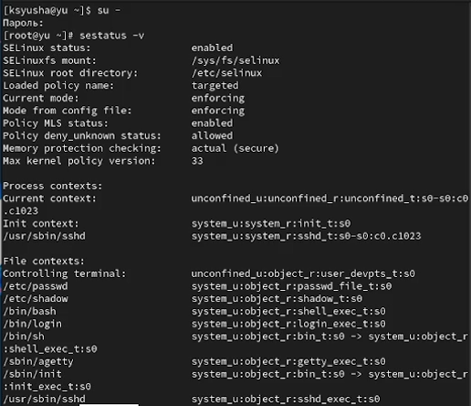{#fig:001 width=40%}

## Выполнение лабораторной работы

Посмотрели, в каком режиме работает SELinux. По умолчанию SELinux находится в режиме принудительного исполнения (Enforcing). Изменили режим работы SELinux на разрешающий (Permissive) и снова ввели getenforce

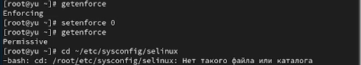{#fig:002 width=70%}

## Выполнение лабораторной работы

В файле /etc/sysconfig/selinux с помощью редактора установили SELINUX=disabled и перезагрузили систему

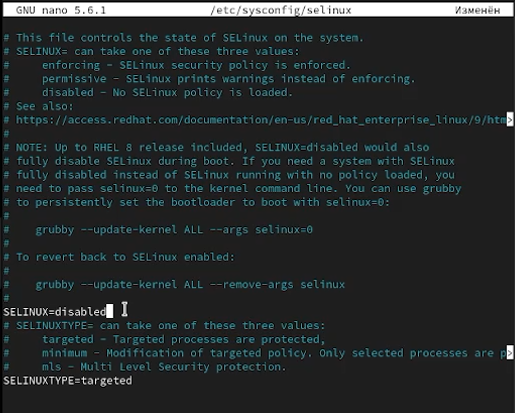{#fig:003 width=50%}

## Выполнение лабораторной работы

После перезагрузки запустили терминал и получили полномочия администратора. Посмотрели статус SELinux и  увидели, что SELinux теперь отключён. Попробовали переключить режим работы SELinux, мы не можем переключаться между отключённым и принудительным режимом без перезагрузки системы

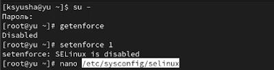{#fig:004 width=70%}

## Выполнение лабораторной работы

Открыли файл /etc/sysconfig/selinux с помощью редактора и установили SELINUX=enforcing и перезагрузили систему. Во время загрузки системы получили предупреждающее сообщение о необходимости восстановления меток SELinux, что может занять некоторое время, а также потребовало дополнительной перезагрузки системы

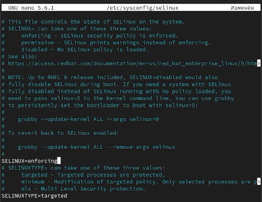{#fig:005 width=40%}

## Выполнение лабораторной работы

После перезагрузки в терминале с полномочиями администратора просмотрели текущую информацию о состоянии SELinux, и убедились, что система работает в принудительном режиме (enforcing) использования SELinux.

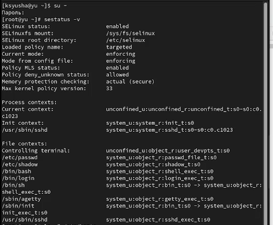{#fig:006 width=40%}

## Выполнение лабораторной работы

Проверили контекст файла /etc/hosts. Скопировали его в домашний каталог - контекст изменился. Исправили контекст безопасности и выполнили массовое восстановление меток 

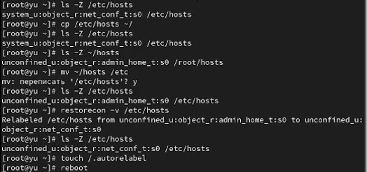{#fig:007 width=70%}

## Выполнение лабораторной работы

Запустили терминал и получили полномочия администратора.
Установили необходимое программное обеспечение.

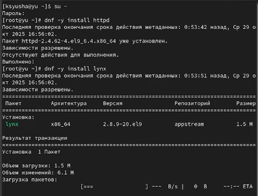{#fig:008 width=40%}

## Выполнение лабораторной работы

Создали новое хранилище для файлов web-сервера и файл index.html в каталоге с контентом веб-сервера

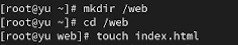{#fig:009 width=70%}

## Выполнение лабораторной работы

Поместили в файл данный нам текст

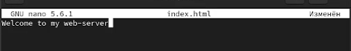{#fig:010 width=70%}

## Выполнение лабораторной работы

В файле /etc/httpd/conf/httpd.conf закомментировали строку DocumentRoot "/var/www/html" и ниже добавили строку DocumentRoot "/web". Затем в этом же файле ниже закомментируйте необходимый раздел и добавили следующий раздел, определяющий правила доступа

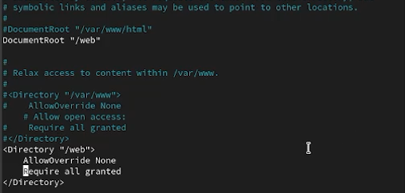{#fig:011 width=70%}

## Выполнение лабораторной работы

Запустили веб-сервер и службу httpd

{#fig:012 width=60%}

## Выполнение лабораторной работы

В терминале под учётной записью своего пользователя при обращении к веб-серверу в текстовом браузере lynx увидели веб-страницу Red Hat по умолчанию, а не содержимое только что созданного файла index.html

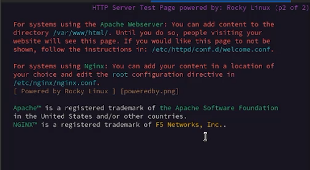{#fig:013 width=70%}

## Выполнение лабораторной работы

В  терминале с полномочиями администратора применили новую метку контекста и восстановили контекст безопасности

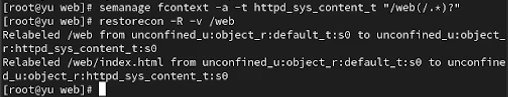{#fig:014 width=70%}

## Выполнение лабораторной работы

В терминале под учётной записью своего пользователя снова обратились к веб-серверу. Теперь мы получили доступ к своей пользовательской веб-странице. На экране отобразилась запись «Welcome to my web-server»

{#fig:015 width=70%}

## Выполнение лабораторной работы

Просмотрели список переключателей SELinux для службы FTP. Обнаружили переключатель ftpd_anon_write в состоянии «off». Используя команды setsebool и setsebool -P, изменили значение переключателя сначала для текущей сессии, а затем на постоянной основе. После применения настроек убедились, что переключатель ftpd_anon_write переведен в состояние «on», что разрешает анонимным пользователям FTP-сервера выполнять операции записи. Данная настройка сохранится после перезагрузки системы.

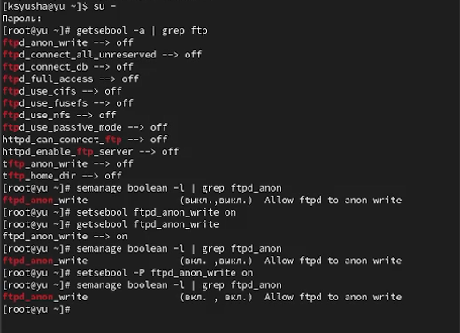{#fig:016 width=40%}

# Выводы

В ходе лабораторной работы мы получили навыки работы с контекстом безопасности и политиками SELinux.

