---
## Front matter
title: "Лабораторная работа №9"
subtitle: Управление SELinux
author: "Юсупова Ксения Равилевна"

## Generic otions
lang: ru-RU
toc-title: "Содержание"

## Bibliography
bibliography: bib/cite.bib
csl: pandoc/csl/gost-r-7-0-5-2008-numeric.csl

## Pdf output format
toc: true # Table of contents
toc-depth: 2
lof: true # List of figures
lot: true # List of tables
fontsize: 12pt
linestretch: 1.5
papersize: a4
documentclass: scrreprt
## I18n polyglossia
polyglossia-lang:
  name: russian
  options:
	- spelling=modern
	- babelshorthands=true
polyglossia-otherlangs:
  name: english
## I18n babel
babel-lang: russian
babel-otherlangs: english
## Fonts
mainfont: IBM Plex Serif
romanfont: IBM Plex Serif
sansfont: IBM Plex Sans
monofont: IBM Plex Mono
mathfont: STIX Two Math
mainfontoptions: Ligatures=Common,Ligatures=TeX,Scale=0.94
romanfontoptions: Ligatures=Common,Ligatures=TeX,Scale=0.94
sansfontoptions: Ligatures=Common,Ligatures=TeX,Scale=MatchLowercase,Scale=0.94
monofontoptions: Scale=MatchLowercase,Scale=0.94,FakeStretch=0.9
mathfontoptions:
## Biblatex
biblatex: true
biblio-style: "gost-numeric"
biblatexoptions:
  - parentracker=true
  - backend=biber
  - hyperref=auto
  - language=auto
  - autolang=other*
  - citestyle=gost-numeric
## Pandoc-crossref LaTeX customization
figureTitle: "Рис."
tableTitle: "Таблица"
listingTitle: "Листинг"
lofTitle: "Список иллюстраций"
lotTitle: "Список таблиц"
lolTitle: "Листинги"
## Misc options
indent: true
header-includes:
  - \usepackage{indentfirst}
  - \usepackage{float} # keep figures where there are in the text
  - \floatplacement{figure}{H} # keep figures where there are in the text
---

# Цель работы
 
Получить навыки работы с контекстом безопасности и политиками SELinux.

# Задание
 
1. Продемонстрируйте навыки по управлению режимами SELinux (см. раздел 9.4.1).

2. Продемонстрируйте навыки по восстановлению контекста безопасности SELinux (см. раздел 9.4.2).

3. Настройте контекст безопасности для нестандартного расположения файлов вебслужбы (см. раздел 9.4.3).

4. Продемонстрируйте навыки работы с переключателями SELinux (см. раздел 9.4.4).

# Выполнение лабораторной работы

Запустили терминал и получили полномочия администратора. Просмотрели текущую информацию о состоянии SELinux. Анализ отчёта показал, что SELinux находится в рабочем состоянии: статус enabled означает, что система включена, а режим enforcing подтверждает, что политика безопасности активно применяется и все нарушения блокируются. В качестве основной используется стандартная политика targeted, которая обеспечивает безопасность, ограничивая только определённые целевые службы, в то время как большинство пользовательских процессов работают без ограничений. Конфигурационные файлы системы расположены в директории /etc/selinux. Было установлено, что текущий режим работы совпадает с режимом, заданным в конфигурации на постоянной основе, что обеспечивает стабильность политики после перезагрузки. Анализ контекстов безопасности процессов показал, что текущая пользовательская сессия (unconfined_t) не ограничена политикой, в то время как критически важные системные процессы, такие как init и демон SSH (sshd_t\)), работают в своих строго заданных доменах. Проверка контекстов ключевых файлов (например, /etc/passwd, /etc/shadow, /bin/bash) подтвердила, что политика корректно различает типы объектов, назначая им соответствующие метки безопасности, такие как passwd_file_tиshadow_t`.(рис. [-@fig:001]).

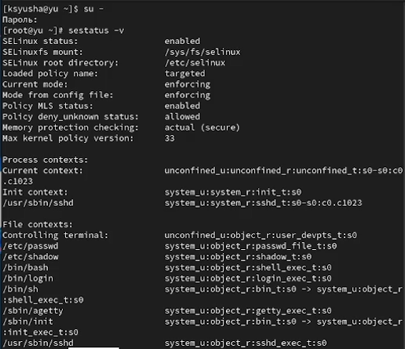{#fig:001 width=70%}

Посмотрели, в каком режиме работает SELinux. По умолчанию SELinux находится в режиме принудительного исполнения (Enforcing). Изменили режим работы SELinux на разрешающий (Permissive) и снова ввели getenforce(рис. [-@fig:002]).

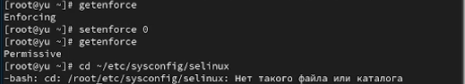{#fig:002 width=70%}

В файле /etc/sysconfig/selinux с помощью редактора установили SELINUX=disabled и перезагрузили систему(рис. [-@fig:003]).

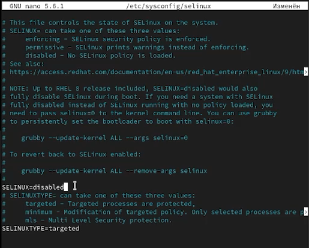{#fig:003 width=70%}

После перезагрузки запустили терминал и получили полномочия администратора. Посмотрели статус SELinux и  увидели, что SELinux теперь отключён. Попробовали переключить режим работы SELinux, мы не можем переключаться между отключённым и принудительным режимом без перезагрузки системы.(рис. [-@fig:004]).

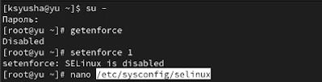{#fig:004 width=70%}

Открыли файл /etc/sysconfig/selinux с помощью редактора и установили SELINUX=enforcing и перезагрузили систему. Во время загрузки системы получили предупреждающее сообщение о необходимости восстановления меток SELinux, что может занять некоторое время, а также потребовало дополнительной перезагрузки системы.([рис. @fig:005]).

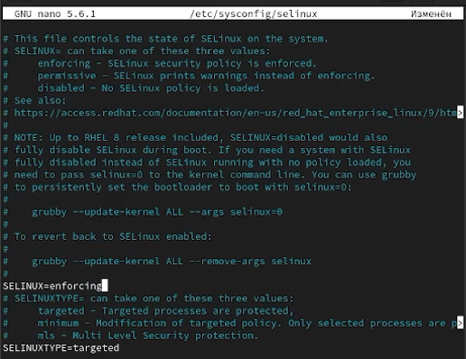{#fig:005 width=70%}

После перезагрузки в терминале с полномочиями администратора просмотрели текущую информацию о состоянии SELinux, и убедились, что система работает в принудительном режиме (enforcing) использования SELinux.([рис. @fig:006]).

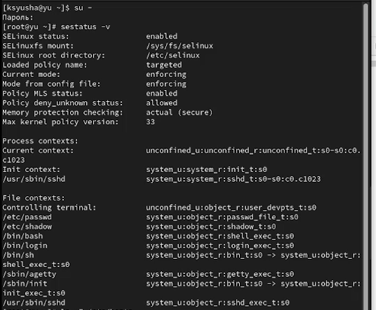{#fig:006 width=70%}

Запустили терминал и получили полномочия администратора, посмотрели контекст безопасности файла /etc/hosts и увидели, что у файла есть метка контекста net_conf_t. Скопировали файл /etc/hosts в домашний каталог и проверили контекст файла ~/hosts. Поскольку копирование считается созданием нового файла, то параметр контекста в файле ~/hosts, расположенном в домашнем каталоге, стал admin_home_t. Попытались перезаписать существующий файл hosts из домашнего каталога в каталог /etc и подтвердили, что хотим сделать это. Убедились, что тип контекста по-прежнему установлен на admin_home_t и исправили контекст безопасности. Убедились, что тип контекста изменился. Для массового исправления контекста безопасности на файловой системе ввели touch /.autorelabel и перезагрузили систему. Во время перезапуска не забыли нажать клавишу Esc на клавиатуре, чтобы видеть загрузочные сообщения. Увидели, что файловая система автоматически перемаркирована.([рис. @fig:007]).

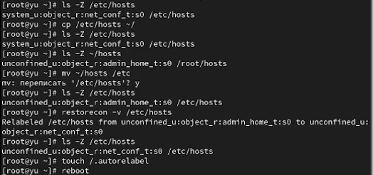{#fig:007 width=70%}

Запустили терминал и получили полномочия администратора.
Установили необходимое программное обеспечение.([рис. @fig:008]).

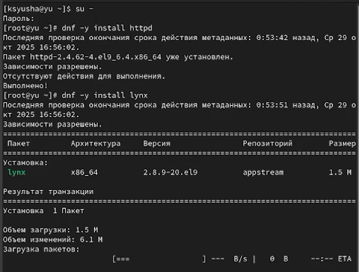{#fig:008 width=70%}

Создали новое хранилище для файлов web-сервера и файл index.html в каталоге с контентом веб-сервера(рис. [-@fig:009]).

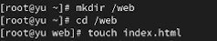{#fig:009 width=70%}

Поместили в файл данный нам текст(рис. [-@fig:010]).

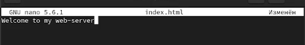{#fig:010 width=70%}

В файле /etc/httpd/conf/httpd.conf закомментировали строку
DocumentRoot "/var/www/html" и ниже добавили строку
DocumentRoot "/web". Затем в этом же файле ниже закомментируйте необходимый раздел и добавили следующий раздел, определяющий правила доступа(рис. [-@fig:011]).

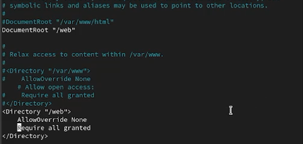{#fig:011 width=70%}

Запустили веб-сервер и службу httpd(рис. [-@fig:012]).

{#fig:012 width=70%}

В терминале под учётной записью своего пользователя при обращении к веб-серверу в текстовом браузере lynx увидели веб-страницу Red Hat по умолчанию, а не содержимое только что созданного файла index.html.([рис. @fig:013]).

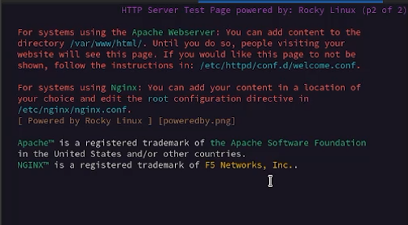{#fig:013 width=70%}

В  терминале с полномочиями администратора применили новую метку контекста и восстановили контекст безопасности([рис. @fig:014]).

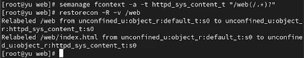{#fig:014 width=70%}

В терминале под учётной записью своего пользователя снова обратились к веб-серверу. Теперь мы получили доступ к своей пользовательской веб-странице. На экране отобразилась запись «Welcome to my web-server».([рис. @fig:015]).

{#fig:015 width=70%}

Запустили терминал и получили полномочия администратора. Посмотрели список переключателей SELinux для службы ftp и увидели переключатель ftpd_anon_write с текущим значением off. Для службы ftpd_anon посмотрели список переключателей с пояснением, за что отвечает каждый переключатель, включён он или выключен. Изменили текущее значение переключателя для службы ftpd_anon_write с off на on. Повторно посмотрели список переключателей SELinux для службы ftpd_anon_write, посмотрели список переключателей с пояснением. Обратили внимание, что настройка времени выполнения включена, но постоянная настройка по-прежнему отключена. Изменили постоянное значение переключателя для службы ftpd_anon_write с off на on. Посмотрели список переключателей. В результате было обнаружено, что булев переключатель ftpd_anon_write находится в состоянии «вкл.» (on). Это означает, что в рамках действующей политики SELinux анонимным пользователям FTP-сервера явно разрешено выполнять операции записи на сервер. Данное состояние активно в текущий момент и будет сохранено после перезагрузки системы.([рис. @fig:016]).

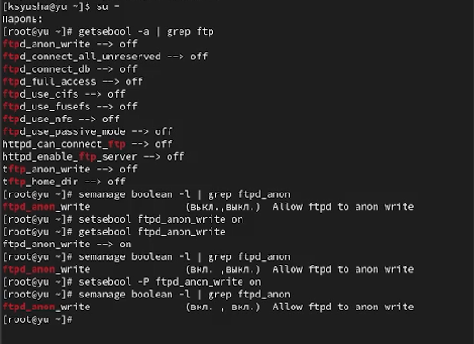{#fig:016 width=70%}

# Ответы на контрольные вопросы

1. Чтобы временно перевести SELinux в разрешающий режим, выполните:  setenforce Permissive

2. Для просмотра всех переключателей (boolean) SELinux используйте: getsebool -a

3. Пакет для удобного просмотра логов SELinux: setroubleshoot-server

4. Чтобы назначить тип `httpd_sys_content_t` для каталога `/web`, выполните: semanage fcontext -a -t httpd_sys_content_t '/web(/.*)?' затем restorecon -Rv /web

5. Полное отключение SELinux производится в файле: /etc/selinux/config (нужно изменить параметр SELINUX=disabled)

6. Логи SELinux находятся в файле: 
/var/log/audit/audit.log

7. Для просмотра настроек FTP в SELinux используйте:  semanage boolean -l | grep ftp

8. Чтобы проверить, связана ли проблема с SELinux: 
   Переведите систему в setenforce Permissive и проверьте работу службы. Если проблема исчезла — причина в политиках SELinux.
   
# Выводы

В ходе лабораторной работы мы получили навыки работы с контекстом безопасности и политиками SELinux.

