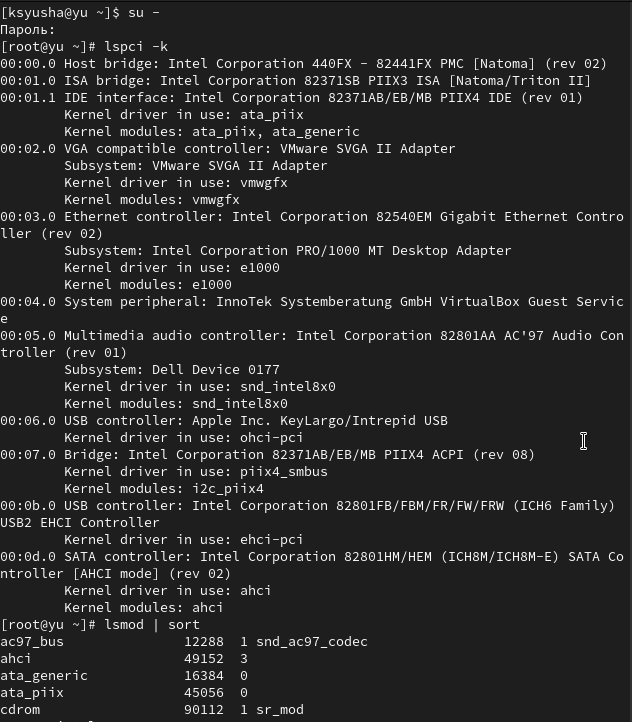
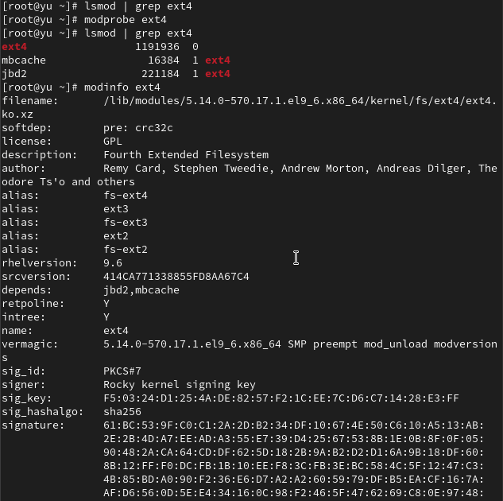
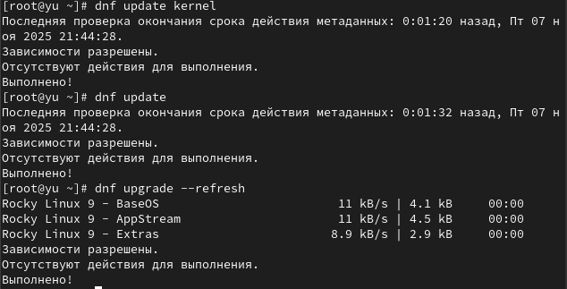
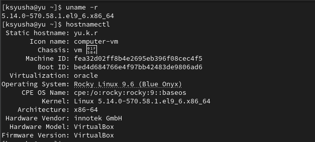

---
## Front matter
lang: ru-RU
title: Лабораторная работа №10
subtitle: Основы работы с модулями ядра операционной системы
author:
  - Юсупова К. Р.
institute:
  - Российский университет дружбы народов, Москва, Россия

## i18n babel
babel-lang: russian
babel-otherlangs: english

## Formatting pdf
toc: false
toc-title: Содержание
slide_level: 2
aspectratio: 169
section-titles: true
theme: metropolis
header-includes:
 - \metroset{progressbar=frametitle,sectionpage=progressbar,numbering=fraction}
---

# Информация

## Докладчик

:::::::::::::: {.columns align=center}
::: {.column width="70%"}

  * Юсупова Ксения Равилевна
  * Российский университет дружбы народов
  * Номер студенческого билета- 1132247531
  * [1132247531@pfur.ru]

:::
::::::::::::::

# Вводная часть

## Цель работы

Получить навыки работы с утилитами управления модулями ядра операционной системы.

# Выполнение лабораторной работы

Получили права администратора. Проверили устройства системы и связанные модули ядра. Система работает в виртуальной среде (VMware/VirtualBox), используются стандартные драйверы ядра Linux

{#fig:001 width=50%}

## Выполнение лабораторной работы

Загрузили модуль ext4. Изучили информацию о модуле - поддерживает ext4/ext3/ext2, имеет зависимости jbd2 и mbcache, не имеет параметров конфигурации 

{#fig:002 width=50%}

## Выполнение лабораторной работы

Попытались выгрузить модуль ext4 - операция невозможна, так как модуль используется системой. Аналогичная ситуация с модулем xfs 

{#fig:003 width=80%}

## Выполнение лабораторной работы

Загрузили модуль bluetooth. Изучили его характеристики - модуль не имеет настраиваемых параметров

{#fig:004 width=50%}

## Выполнение лабораторной работы

Выгрузили модуль bluetooth. Проверили версию ядра и список пакетов ядра. Обновили систему для подготовки к обновлению ядра 

{#fig:005 width=50%}

## Выполнение лабораторной работы

Выполнили обновление ядра операционной системы и перезагрузили систему с выбором нового ядра

{#fig:006 width=70%}

## Выполнение лабораторной работы

Подтвердили успешное обновление, проверив текущую версию ядра 

{#fig:007 width=70%}

# Выводы

В ходе лабораторной работы мы получили навыки работы с утилитами управления модулями ядра операционной системы.

