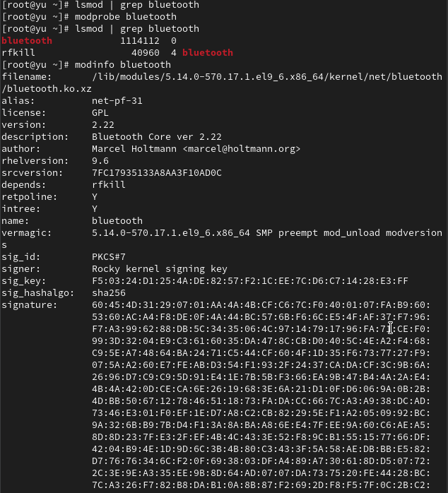
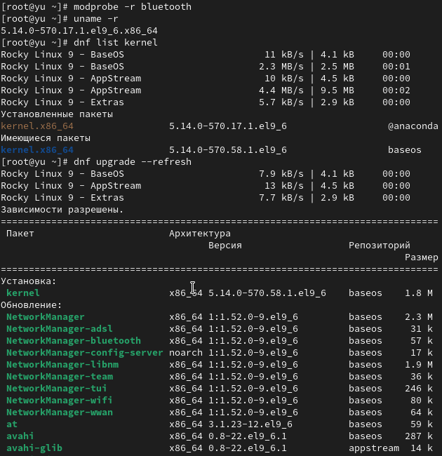

---
## Front matter
title: "Лабораторная работа №10"
subtitle: Основы работы с модулями ядра операционной системы
author: "Юсупова Ксения Равилевна"

## Generic otions
lang: ru-RU
toc-title: "Содержание"

## Bibliography
bibliography: bib/cite.bib
csl: pandoc/csl/gost-r-7-0-5-2008-numeric.csl

## Pdf output format
toc: true # Table of contents
toc-depth: 2
lof: true # List of figures
lot: true # List of tables
fontsize: 12pt
linestretch: 1.5
papersize: a4
documentclass: scrreprt
## I18n polyglossia
polyglossia-lang:
  name: russian
  options:
	- spelling=modern
	- babelshorthands=true
polyglossia-otherlangs:
  name: english
## I18n babel
babel-lang: russian
babel-otherlangs: english
## Fonts
mainfont: IBM Plex Serif
romanfont: IBM Plex Serif
sansfont: IBM Plex Sans
monofont: IBM Plex Mono
mathfont: STIX Two Math
mainfontoptions: Ligatures=Common,Ligatures=TeX,Scale=0.94
romanfontoptions: Ligatures=Common,Ligatures=TeX,Scale=0.94
sansfontoptions: Ligatures=Common,Ligatures=TeX,Scale=MatchLowercase,Scale=0.94
monofontoptions: Scale=MatchLowercase,Scale=0.94,FakeStretch=0.9
mathfontoptions:
## Biblatex
biblatex: true
biblio-style: "gost-numeric"
biblatexoptions:
  - parentracker=true
  - backend=biber
  - hyperref=auto
  - language=auto
  - autolang=other*
  - citestyle=gost-numeric
## Pandoc-crossref LaTeX customization
figureTitle: "Рис."
tableTitle: "Таблица"
listingTitle: "Листинг"
lofTitle: "Список иллюстраций"
lotTitle: "Список таблиц"
lolTitle: "Листинги"
## Misc options
indent: true
header-includes:
  - \usepackage{indentfirst}
  - \usepackage{float} # keep figures where there are in the text
  - \floatplacement{figure}{H} # keep figures where there are in the text
---

# Цель работы
 
Получить навыки работы с утилитами управления модулями ядра операционной системы.

# Задание
 
1. Продемонстрируйте навыки работы по управлению модулями ядра (см. раздел 10.4.1).

2. Продемонстрируйте навыки работы по загрузке модулей ядра с параметрами (см. раздел 10.4.2).

# Выполнение лабораторной работы

Запустили терминал и получили полномочия администратора; посмотрели, какие устройства имеются в системе и какие модули ядра с ними связаны. Система работает в виртуальной среде (VMware/VirtualBox), что подтверждается наличием: 1) Видеоконтроллера VMware SVGA II ; 2) Сервиса VirtualBox Guest Service; Используются стандартные драйверы ядра Linux для всего оборудования, что обеспечивает стабильную работу в виртуализированной среде. Также посмотрели, какие модули ядра загружены(рис. [-@fig:001]).

{#fig:001 width=70%}

Посмотрели, что не загружен модуль ext4 и загрузили его Посмотрели информацию о модуле ядра ext4 и обратили внимание, что у этого модуля нет параметров. Модуль ext4 поддерживает файловые системы ext4, ext3 и ext2. Расположен в /lib/modules/, имеет зависимости: jbd2 и mbcache. Модуль подписан, не имеет параметров конфигурации.(рис. [-@fig:002]).

{#fig:002 width=70%}

Попробовали выгрузить модуль ядра ext4. Выгрузка невозможна - модуль используется системой. Ошибка: "Module crc32c_intel is in use". Модуль занят, так как файловая система активна. Попробовали выгрузить также модуль ядра xfs, обратили внимание, что получаем сообщение об ошибке, поскольку модуль ядра в данный момент используется.(рис. [-@fig:003]).

{#fig:003 width=70%}

Запустили терминал и получили полномочия администратора. Посмотрели, что не загружен модуль bluetooth и загрузили его. Посмотрели список модулей ядра, отвечающих за работу с Bluetooth и информацию о модуле bluetooth. Модуль bluetooth работает со стандартными настройками без возможности конфигурации через параметры загрузки.
(рис. [-@fig:004]).

{#fig:004 width=70%}

Выгрузили модуль ядра bluetooth и запустили терминал с полномочиями администратора, посмотрели версию ядра, используемую в операционной системе и вывели на экран список пакетов, относящихся к ядру операционной системы. Затем обновили систему, чтобы убедиться, что все существующие пакеты обновлены, так как это важно при установке/обновлении ядер Linux и избежания конфликтов ([рис. @fig:005]).

{#fig:005 width=70%}

Обновили ядро операционной системы, а затем саму операционную систему и перегрузили систему. При загрузке выбрали новое ядро.([рис. @fig:006]).

{#fig:006 width=70%}

Посмотрели версию ядра, используемую в операционной системы([рис. @fig:007]).

{#fig:007 width=70%}

# Ответы на контрольные вопросы

1. uname -r - показывает краткую информацию о версии ядра (например: 5.14.0-70.el9.x86_64)

2. uname -a - выводит полную информацию о системе и ядре, включая архитектуру и дату сборки

3. lsmod - отображает список всех загруженных модулей ядра с размерами и зависимостями

4. modinfo имя_модуля - показывает подробную информацию о модуле, включая параметры, лицензию и зависимости

5. modprobe -r имя_модуля - выгружает модуль, если он не используется другими модулями или процессами

6. Если модуль нельзя выгрузить, нужно:
  
   - Найти использующие его процессы: lsof | grep модуль
   
   - Принудительно завершить процессы или перезагрузить систему

7. modinfo -p имя_модуля - отображает все доступные параметры модуля с их описанием

8. Для установки новой версии ядра в Rocky Linux:
  
   - dnf search kernel - найти доступные версии
  
   - dnf install kernel-версия - установить выбранную версию
  
   - Перезагрузить систему и выбрать новое ядро в загрузчике
   
# Выводы

В ходе лабораторной работы мы получили навыки работы с утилитами управления модулями ядра операционной системы.

