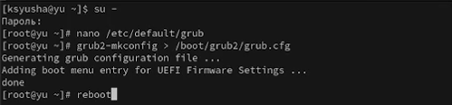
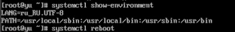
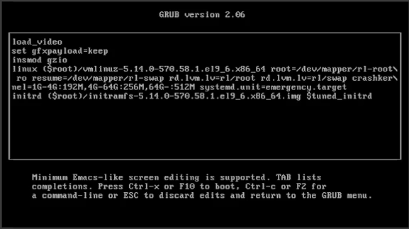
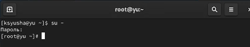

---
## Front matter
lang: ru-RU
title: Лабораторная работа №11
subtitle: Управление загрузкой системы
author:
  - Юсупова К. Р.
institute:
  - Российский университет дружбы народов, Москва, Россия

## i18n babel
babel-lang: russian
babel-otherlangs: english

## Formatting pdf
toc: false
toc-title: Содержание
slide_level: 2
aspectratio: 169
section-titles: true
theme: metropolis
header-includes:
 - \metroset{progressbar=frametitle,sectionpage=progressbar,numbering=fraction}
---

# Информация

## Докладчик

:::::::::::::: {.columns align=center}
::: {.column width="70%"}

  * Юсупова Ксения Равилевна
  * Российский университет дружбы народов
  * Номер студенческого билета- 1132247531
  * [1132247531@pfur.ru]

:::
::::::::::::::

# Вводная часть

## Цель работы

Получить навыки работы с загрузчиком системы GRUB2.

# Выполнение лабораторной работы

Запустили терминал и получили полномочия администратора. В файле /etc/default/grub установили параметр отображения меню загрузки в течение 10 секунд

{#fig:001 width=70%}

## Выполнение лабораторной работы

Записали изменения в GRUB2, перезагрузили систему и убедились, что при загрузке видим прокрутку загрузочных сообщений

{#fig:002 width=70%}

## Выполнение лабораторной работы

Перегрузили систему. Изменили строку с linux ($root)/vmlinuz-. Эта строка загружает ядро системы. В конце этой строки ввели systemd.unit=rescue.target и удалили опции rhgb и quit из этой строки 

{#fig:003 width=70%}

## Выполнение лабораторной работы

Ввели пароль пользователя root при появлении запроса. Посмотрели список всех файлов модулей, которые загружены в настоящее время, увидели, что загружена базовая системная среда

{#fig:004 width=70%}

## Выполнение лабораторной работы

Посмотрели задействованные переменные среды оболочки и перегрузили систему

{#fig:005 width=70%}

## Выполнение лабораторной работы

В меню GRUB, ещё раз нажали e на строке с текущей версией ядра, чтобы войти в режим редактора. В конце строки, загружающей ядро, ввели systemd.unit=emergency.target и удалили опции rhgb и quit из этой строки

{#fig:006 width=70%}

## Выполнение лабораторной работы

Ввели пароль пользователя root при появлении запроса. После успешного входа в систему посмотрели список всех загруженных файлов модулей. Обратили внимание, что количество загружаемых файлов модулей уменьшилось до минимума. Перегрузили систему

{#fig:007 width=70%}

## Выполнение лабораторной работы

Перегрузили систему. В меню grub вошли в режим редактора. В конце строки, загружающей ядро, ввели rd.break и удалили опции rhgb и quit

{#fig:008 width=70%}

## Выполнение лабораторной работы

Этап загрузки системы остановился в момент загрузки initramfs, непосредственно перед монтированием корневой файловой системы в каталоге /. Получили доступ к системному образу для чтения и записи, сделали содержимое каталога /sysimage новым корневым каталогом, установили новый пароль для пользователя root

{#fig:009 width=70%}

## Выполнение лабораторной работы

Загрузили политику SELinux, вручную установили правильный тип контекста для /etc/shadow и перезагрузилите систему с помощью команды reboot -f 

{#fig:010 width=70%}

## Выполнение лабораторной работы

Вошли в систему с изменённым паролем для пользователя root

{#fig:011 width=70%}

# Выводы

В ходе лабораторной работы мы получили навыки работы с загрузчиком системы GRUB2.

