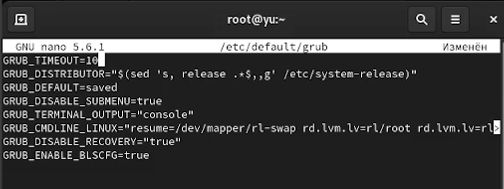
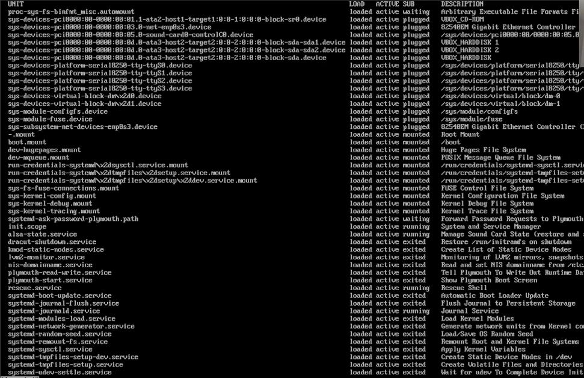
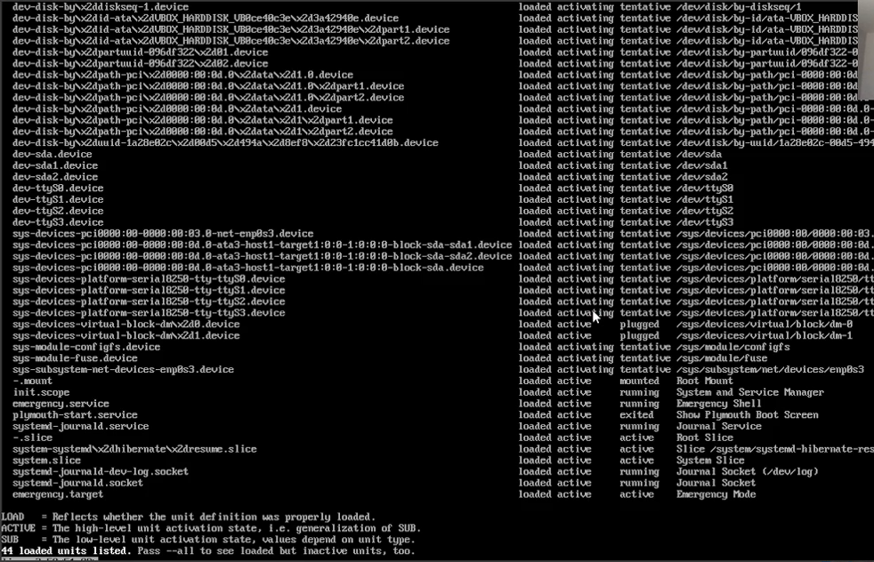
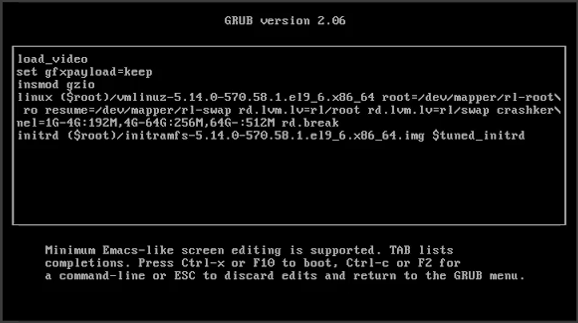
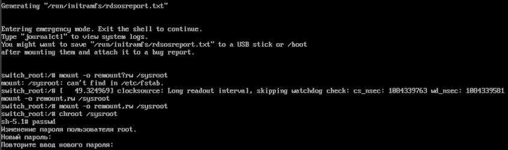
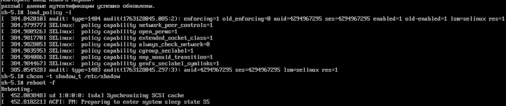

---
## Front matter
title: "Лабораторная работа №11"
subtitle: Управление загрузкой системы
author: "Юсупова Ксения Равилевна"

## Generic otions
lang: ru-RU
toc-title: "Содержание"

## Bibliography
bibliography: bib/cite.bib
csl: pandoc/csl/gost-r-7-0-5-2008-numeric.csl

## Pdf output format
toc: true # Table of contents
toc-depth: 2
lof: true # List of figures
lot: true # List of tables
fontsize: 12pt
linestretch: 1.5
papersize: a4
documentclass: scrreprt
## I18n polyglossia
polyglossia-lang:
  name: russian
  options:
	- spelling=modern
	- babelshorthands=true
polyglossia-otherlangs:
  name: english
## I18n babel
babel-lang: russian
babel-otherlangs: english
## Fonts
mainfont: IBM Plex Serif
romanfont: IBM Plex Serif
sansfont: IBM Plex Sans
monofont: IBM Plex Mono
mathfont: STIX Two Math
mainfontoptions: Ligatures=Common,Ligatures=TeX,Scale=0.94
romanfontoptions: Ligatures=Common,Ligatures=TeX,Scale=0.94
sansfontoptions: Ligatures=Common,Ligatures=TeX,Scale=MatchLowercase,Scale=0.94
monofontoptions: Scale=MatchLowercase,Scale=0.94,FakeStretch=0.9
mathfontoptions:
## Biblatex
biblatex: true
biblio-style: "gost-numeric"
biblatexoptions:
  - parentracker=true
  - backend=biber
  - hyperref=auto
  - language=auto
  - autolang=other*
  - citestyle=gost-numeric
## Pandoc-crossref LaTeX customization
figureTitle: "Рис."
tableTitle: "Таблица"
listingTitle: "Листинг"
lofTitle: "Список иллюстраций"
lotTitle: "Список таблиц"
lolTitle: "Листинги"
## Misc options
indent: true
header-includes:
  - \usepackage{indentfirst}
  - \usepackage{float} # keep figures where there are in the text
  - \floatplacement{figure}{H} # keep figures where there are in the text
---

# Цель работы
 
Получить навыки работы с загрузчиком системы GRUB2.

# Задание
 
1. Продемонстрируйте навыки по изменению параметров GRUB и записи изменений в файл конфигурации (см. раздел 11.4.1).

2. Продемонстрируйте навыки устранения неполадок при работе с GRUB (см. раздел 11.4.2).

3. Продемонстрируйте навыки работы с GRUB без использования root (см. раздел 11.4.3).

# Выполнение лабораторной работы

Запустили терминал и получили полномочия администратора. В файле /etc/default/grub установили параметр отображения меню загрузки в течение 10 секунд (рис. [-@fig:001]).

{#fig:001 width=70%}

Записали изменения в GRUB2, перезагрузили систему и убедились, что при загрузке видим прокрутку загрузочных сообщений. (рис. [-@fig:002]).

{#fig:002 width=70%}

Перегрузили систему. Изменили строку с linux ($root)/vmlinuz-. Эта строка загружает ядро системы. В конце этой строки ввели systemd.unit=rescue.target и удалили опции rhgb и quit из этой строки (рис. [-@fig:003]).

{#fig:003 width=70%}

Ввели пароль пользователя root при появлении запроса. Посмотрели список всех файлов модулей, которые загружены в настоящее время, увидели, что загружена базовая системная среда(рис. [-@fig:004]).

{#fig:004 width=70%}

Посмотрели задействованные переменные среды оболочки и перегрузили систему([рис. @fig:005]).

{#fig:005 width=70%}

В меню GRUB, ещё раз нажали e на строке с текущей версией ядра, чтобы войти в режим редактора. В конце строки, загружающей ядро, ввели systemd.unit=emergency.target и удалили опции rhgb и quit из этой строки([рис. @fig:006]).

{#fig:006 width=70%}

Ввели пароль пользователя root при появлении запроса. После успешного входа в систему посмотрели список всех загруженных файлов модулей. Обратили внимание, что количество загружаемых файлов модулей уменьшилось до минимума. Перегрузили систему([рис. @fig:007]).

{#fig:007 width=70%}

Перегрузили систему. В меню grub вошли в режим редактора. В конце строки, загружающей ядро, ввели rd.break и удалили опции rhgb и quit([рис. @fig:008]).

{#fig:008 width=70%}

Этап загрузки системы остановился в момент загрузки initramfs, непосредственно перед монтированием корневой файловой системы в каталоге /. Получили доступ к системному образу для чтения и записи, сделали содержимое каталога /sysimage новым корневым каталогом, установили новый пароль для пользователя root(рис. [-@fig:009]).

{#fig:009 width=70%}

Загрузили политику SELinux, вручную установили правильный тип контекста для /etc/shadow и перезагрузилите систему с помощью команды reboot -f (рис. [-@fig:010]).

{#fig:010 width=70%}

Вошли в систему с изменённым паролем для пользователя root(рис. [-@fig:011]).

{#fig:011 width=70%}

# Ответы на контрольные вопросы

1. Основной файл для внесения общих изменений в GRUB2 — `/etc/default/grub`. В этом файле задаются параметры, такие как таймаут загрузки, аргументы ядра по умолчанию и другие настройки, влияющие на поведение загрузчика.

2. Изменения вносятся в файл `/etc/default/grub`. Окончательный файл конфигурации, который используется непосредственно загрузчиком, — `/boot/grub2/grub.cfg`, но он автоматически генерируется на основе `/etc/default/grub` и скриптов из `/etc/grub.d`.

3. После редактирования файла `/etc/default/grub` необходимо выполнить команду: 

   grub2-mkconfig -o /boot/grub2/grub.cfg

   Эта команда пересобирает конфигурационный файл `/boot/grub2/grub.cfg` с учётом внесённых изменений, чтобы они применились при следующей загрузке системы.
   
# Выводы

В ходе лабораторной работы мы получили навыки работы с загрузчиком системы GRUB2.

