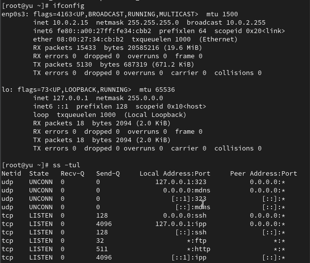

---
## Front matter
lang: ru-RU
title: Лабораторная работа №12
subtitle: Настройки сети в Linux
author:
  - Юсупова К. Р.
institute:
  - Российский университет дружбы народов, Москва, Россия

## i18n babel
babel-lang: russian
babel-otherlangs: english

## Formatting pdf
toc: false
toc-title: Содержание
slide_level: 2
aspectratio: 169
section-titles: true
theme: metropolis
header-includes:
 - \metroset{progressbar=frametitle,sectionpage=progressbar,numbering=fraction}
---

# Информация

## Докладчик

:::::::::::::: {.columns align=center}
::: {.column width="70%"}

  * Юсупова Ксения Равилевна
  * Российский университет дружбы народов
  * Номер студенческого билета- 1132247531
  * [1132247531@pfur.ru]

:::
::::::::::::::

# Вводная часть

## Цель работы
 
Получить навыки настройки сетевых параметров системы

# Выполнение лабораторной работы

Получили права администратора. Проверили сетевые подключения, статистику пакетов и маршрутизацию. Интерфейс enp0s3 активен с адресом 10.0.2.15/24, шлюзом 10.0.2.2. Передача данных без ошибок

{#fig:001 width=50%}

## Выполнение лабораторной работы

Использовали команду ping для проверки правильности подключения к Интернету. Отправили четыре пакета на IP-адрес 8.8.8.8. Добавили дополнительный адрес к вашему интерфейсу и  проверили, что адрес добавился 

{#fig:002 width=50%}

## Выполнение лабораторной работы

Сравнили вывод ip addr show и ifconfig. Команда ip показывает больше деталей, включая все адреса интерфейса. Проверили открытые порты системы 

{#fig:003 width=40%}

## Выполнение лабораторной работы

Получили полномочия администратора. Вывели на экран информацию о текущих соединениях, добавили Ethernet-соединение с именем dhcp к интерфейсу и добавили к этому же интерфейсу Ethernet-соединение с именем static, статическим IPv4-адресом адаптера и статическим адресом шлюза. Вывели информацию о текущих соединениях и переключились на статическое соединение,  проверили успешность переключения при помощи nmcli connection show
и ip addr. И вернулись к соединению dhcp, позже проверили успешность переключения при помощи nmcli connection show и ip addr

{#fig:004 width=30%}

## Выполнение лабораторной работы

Настроили статическое соединение: отключили автоподключение, добавили DNS-серверы 8.8.8.8 и 10.0.0.10, изменили IP-адрес

{#fig:005 width=40%}

## Выполнение лабораторной работы

Используя nmtui, посмотрели настройки сети на устройстве. В интерфейсе nmtui настроен профиль "start1" для сетевого устройства. IPv4 настроен вручную с адресами 192.168.0.20/24 и 20.30.40.0/16, шлюзом 192.168.0.1 и DNS-серверами 192.168.0.10, 8.8.8.8. IPv6 настроен автоматически. Установлены опции игнорирования автоматических маршрутов и DNS.

{#fig:006 width=40%}

## Выполнение лабораторной работы

Посмотрели настройки сетевых соединений в графическом интерфейсе операционной системы. Интерфейс enp0s3 имеет статическую настройку с IPv4-адресом 10.20.30.40, шлюзом 10.0.0.1 и DNS-серверами 10.0.0.10, 8.8.8.8. IPv6-адрес назначен автоматически. VPN не настроен, прокси выключен. Оба интерфейса показывают ручную настройку IPv4 с использованием двух DNS-серверов.

{#fig:007 width=40%}

## Выполнение лабораторной работы

Переключились на первоначальное сетевое соединение

{#fig:008 width=70%}

# Ответы на контрольные вопросы

1. ip link show - отображает статус интерфейсов без IP-адресов.

2. NetworkManager - основная служба управления сетью в RHEL и производных.

3. /etc/hostname - содержит постоянное имя узла.

4. hostnamectl set-hostname <имя> - устанавливает имя узла.

5. /etc/hosts - для статического разрешения имён.

6. ip route show - показывает таблицу маршрутизации.

7. systemctl status NetworkManager - проверяет статус службы.

8. nmcli connection modify - изменяет параметры подключения (например: nmcli con mod "подключение" ipv4.addresses 192.168.1.10/24 ipv4.gateway 192.168.1.1).
   
# Выводы

В ходе лабораторной работы мы получили навыки настройки сетевых параметров системы.

