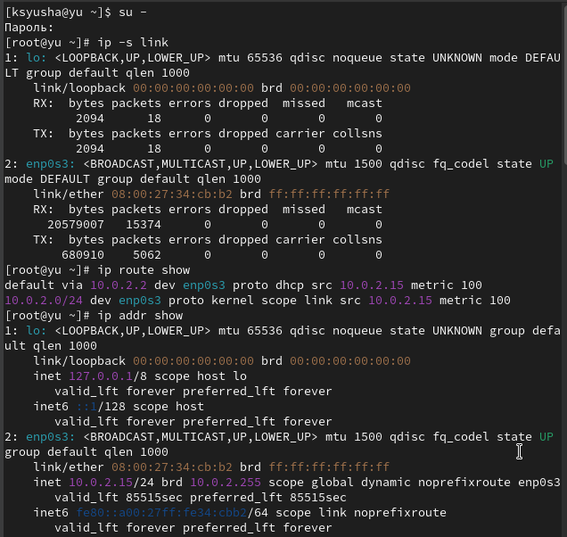
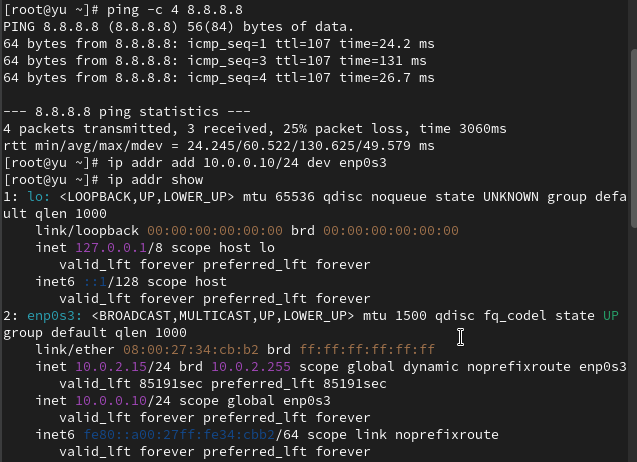
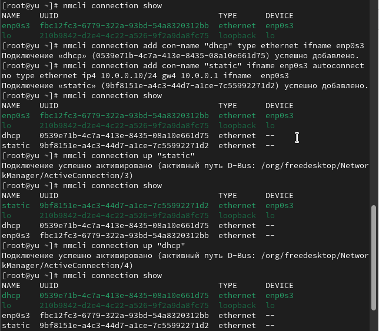
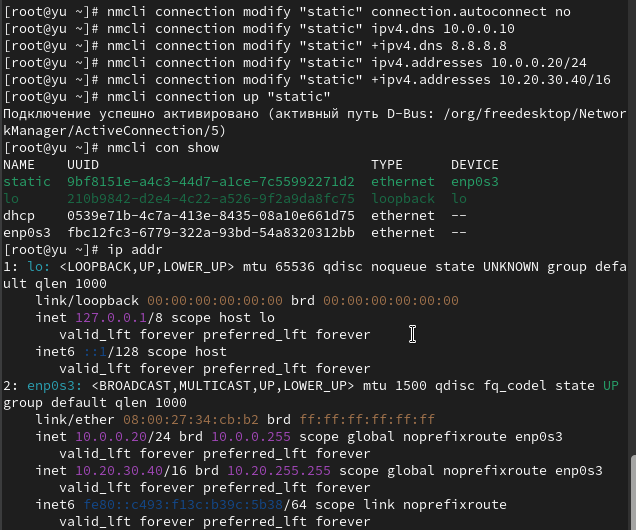
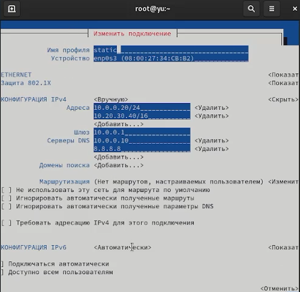
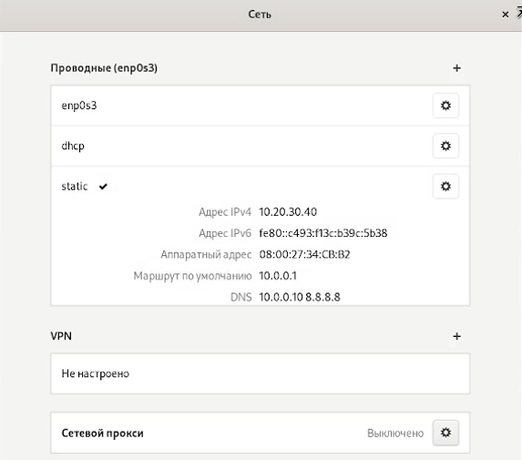
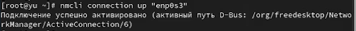

---
## Front matter
title: "Лабораторная работа №12"
subtitle: Настройки сети в Linux
author: "Юсупова Ксения Равилевна"

## Generic otions
lang: ru-RU
toc-title: "Содержание"

## Bibliography
bibliography: bib/cite.bib
csl: pandoc/csl/gost-r-7-0-5-2008-numeric.csl

## Pdf output format
toc: true # Table of contents
toc-depth: 2
lof: true # List of figures
lot: true # List of tables
fontsize: 12pt
linestretch: 1.5
papersize: a4
documentclass: scrreprt
## I18n polyglossia
polyglossia-lang:
  name: russian
  options:
	- spelling=modern
	- babelshorthands=true
polyglossia-otherlangs:
  name: english
## I18n babel
babel-lang: russian
babel-otherlangs: english
## Fonts
mainfont: IBM Plex Serif
romanfont: IBM Plex Serif
sansfont: IBM Plex Sans
monofont: IBM Plex Mono
mathfont: STIX Two Math
mainfontoptions: Ligatures=Common,Ligatures=TeX,Scale=0.94
romanfontoptions: Ligatures=Common,Ligatures=TeX,Scale=0.94
sansfontoptions: Ligatures=Common,Ligatures=TeX,Scale=MatchLowercase,Scale=0.94
monofontoptions: Scale=MatchLowercase,Scale=0.94,FakeStretch=0.9
mathfontoptions:
## Biblatex
biblatex: true
biblio-style: "gost-numeric"
biblatexoptions:
  - parentracker=true
  - backend=biber
  - hyperref=auto
  - language=auto
  - autolang=other*
  - citestyle=gost-numeric
## Pandoc-crossref LaTeX customization
figureTitle: "Рис."
tableTitle: "Таблица"
listingTitle: "Листинг"
lofTitle: "Список иллюстраций"
lotTitle: "Список таблиц"
lolTitle: "Листинги"
## Misc options
indent: true
header-includes:
  - \usepackage{indentfirst}
  - \usepackage{float} # keep figures where there are in the text
  - \floatplacement{figure}{H} # keep figures where there are in the text
---

# Цель работы
 
Получить навыки настройки сетевых параметров системы

# Задание
 
1. Продемонстрируйте навыки использования утилиты ip (см. раздел 12.4.1).

2. Продемонстрируйте навыки использования утилиты nmcli (см. раздел 12.4.2 и 12.4.3)

# Выполнение лабораторной работы

Получили полномочия администратора и вывели на экран информацию о существующих сетевых подключениях, а также статистику о количестве отправленных пакетов и связанных с ними сообщениях об ошибках. Основной интерфейс enp0s3 активен (состояние UP), имеет MAC-адрес 08:00:27:34:cb:b2 и MTU 1500. Зафиксировано успешное получение 15374 пакетов объемом 20.5 МБ и отправка 5062 пакетов объемом 680 КБ без ошибок передачи. Затем вывели на экран информацию о текущих маршрутах и о текущих назначениях адресов для сетевых интерфейсов на устройстве. Команда ip route show показала таблицу маршрутизации. Настроен маршрут по умолчанию через шлюз 10.0.2.2 на интерфейсе enp0s3. Локальная сеть 10.0.2.0/24 доступна напрямую через этот же интерфейс. Маршруты получены по DHCP с метрикой 100. Команда ip addr show отобразила назначенные адреса. Интерфейс enp0s3 имеет динамически полученный IPv4-адрес 10.0.2.15/24 в сети 10.0.2.0/24 с широковещательным адресом 10.0.2.255. Также настроен IPv6-адрес link-local fe80::a00:27ff:fe34:cbb2/64. Сетевой адаптер идентифицируется как enp0s3. Система корректно настроена для работы в сети с автоматически назначенными параметрами через DHCP, все сетевые интерфейсы функционируют без ошибок.(рис. [-@fig:001]).

{#fig:001 width=70%}

Использовали команду ping для проверки правильности подключения к Интернету. Отправили четыре пакета на IP-адрес 8.8.8.8. Добавили дополнительный адрес к вашему интерфейсу и  проверили, что адрес добавился (рис. [-@fig:002]).

{#fig:002 width=70%}

Сравнили вывод информации от утилиты ip и от команды ifconfig. Обе команды отображают информацию о сетевых интерфейсах, но с различиями в детализации и формате. Команда ip addr show выводит более полную информацию: показывает все IP-адреса интерфейса (включая дополнительно назначенный 10.0.0.10/24), указывает тип назначения адреса (dynamic для 10.0.2.15), отображает зоны действия адресов (scope) и время жизни. Команда ifconfig предожает более компактный вывод, отображая только основные параметры: IP-адреса, маску сети в традиционном формате, статистику пакетов и флаги интерфейса. При этом ifconfig не показывает дополнительный адрес 10.0.0.10 и не указывает тип получения адреса. Вывели на экран список всех прослушиваемых системой портов UDP и TCP (рис. [-@fig:003]).

{#fig:003 width=70%}

Получили полномочия администратора. Вывели на экран информацию о текущих соединениях, добавили Ethernet-соединение с именем dhcp к интерфейсу и добавили к этому же интерфейсу Ethernet-соединение с именем static, статическим IPv4-адресом адаптера и статическим адресом шлюза. Вывели информацию о текущих соединениях и переключились на статическое соединение,  проверили успешность переключения при помощи nmcli connection show
и ip addr. И вернулись к соединению dhcp, позже проверили успешность переключения при помощи nmcli connection show и ip addr(рис. [-@fig:004]).

{#fig:004 width=70%}

Отключили автоподключение статического соединения и добавили DNS-сервер в статическое соединение. Обратили внимание, что при добавлении сетевого подключения используется ip4, а при изменении параметров для существующего соединения используется ipv4. Для добавления второго и последующих элементов для тех же параметров используется знак +. Если этот знак проигнорировать, то произойдёт замена, а не добавление элемента. Добавили второй DNS-сервер и изменили IP-адрес статического соединения. Добавили другой IP-адрес для статического соединения. После изменения свойств соединения активировали его. Проверили успешность переключения при помощи nmcli con show и ip addr.([рис. @fig:005]).

{#fig:005 width=70%}

Используя nmtui, посмотрели настройки сети на устройстве. В интерфейсе nmtui настроен профиль "start1" для сетевого устройства. IPv4 настроен вручную с адресами 192.168.0.20/24 и 20.30.40.0/16, шлюзом 192.168.0.1 и DNS-серверами 192.168.0.10, 8.8.8.8. IPv6 настроен автоматически. Установлены опции игнорирования автоматических маршрутов и DNS.([рис. @fig:006]).

{#fig:006 width=70%}

Посмотрели настройки сетевых соединений в графическом интерфейсе операционной системы. Интерфейс enp0s3 имеет статическую настройку с IPv4-адресом 10.20.30.40, шлюзом 10.0.0.1 и DNS-серверами 10.0.0.10, 8.8.8.8. IPv6-адрес назначен автоматически. VPN не настроен, прокси выключен. Оба интерфейса показывают ручную настройку IPv4 с использованием двух DNS-серверов.([рис. @fig:007]).

{#fig:007 width=70%}

Переключились на первоначальное сетевое соединение([рис. @fig:008]).

{#fig:008 width=70%}

# Ответы на контрольные вопросы

1. ip link show - отображает статус интерфейсов без IP-адресов.

2. NetworkManager - основная служба управления сетью в RHEL и производных.

3. /etc/hostname - содержит постоянное имя узла.

4. hostnamectl set-hostname <имя> - устанавливает имя узла.

5. /etc/hosts - для статического разрешения имён.

6. ip route show - показывает таблицу маршрутизации.

7. systemctl status NetworkManager - проверяет статус службы.

8. nmcli connection modify - изменяет параметры подключения (например: nmcli con mod "подключение" ipv4.addresses 192.168.1.10/24 ipv4.gateway 192.168.1.1).
   
# Выводы

В ходе лабораторной работы мы получили навыки настройки сетевых параметров системы.

