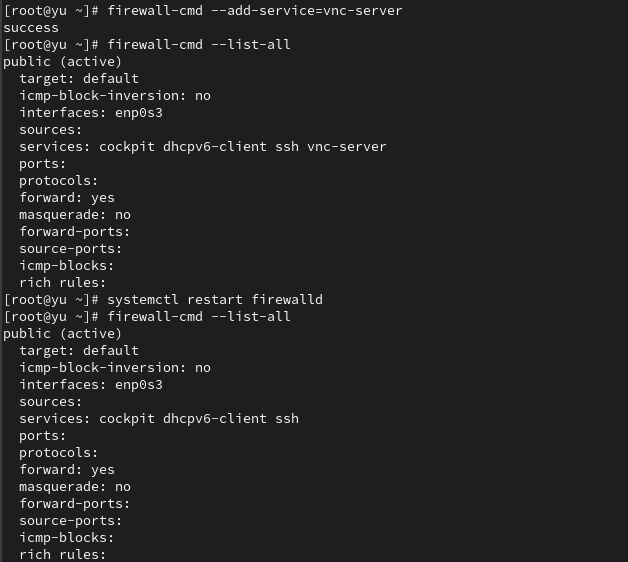
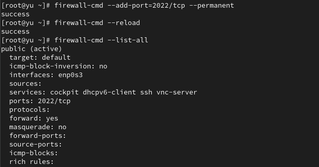
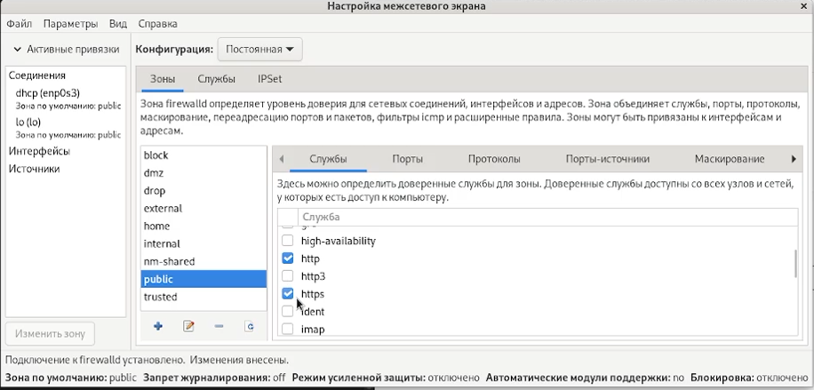
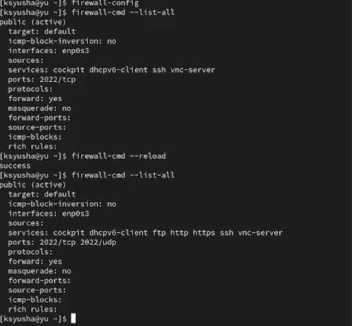
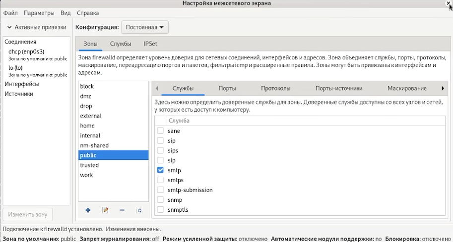
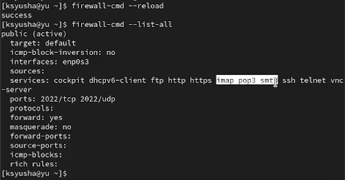

---
## Front matter
lang: ru-RU
title: Лабораторная работа №13
subtitle: Фильтр пакетов
author:
  - Юсупова К. Р.
institute:
  - Российский университет дружбы народов, Москва, Россия

## i18n babel
babel-lang: russian
babel-otherlangs: english

## Formatting pdf
toc: false
toc-title: Содержание
slide_level: 2
aspectratio: 169
section-titles: true
theme: metropolis
header-includes:
 - \metroset{progressbar=frametitle,sectionpage=progressbar,numbering=fraction}
---

# Информация

## Докладчик

:::::::::::::: {.columns align=center}
::: {.column width="70%"}

  * Юсупова Ксения Равилевна
  * Российский университет дружбы народов
  * Номер студенческого билета- 1132247531
  * [1132247531@pfur.ru]

:::
::::::::::::::

# Вводная часть

## Цель работы
 
Получить навыки настройки пакетного фильтра в Linux.

# Выполнение лабораторной работы

Получили полномочия администратора, определили текущую зону по умолчанию, доступные зоны и посмотрели службы, доступные на компьютере

{#fig:001 width=50%}

## Выполнение лабораторной работы

Определили доступные службы в текущей зонеи сравнили результаты вывода информации при использовании команды firewall-cmd --list-all и команды firewall-cmd --list-all --zone=public 

{#fig:002 width=50%}

## Выполнение лабораторной работы

Добавили сервер VNC в конфигурацию брандмауэра, проверили, что добавился vnc-server в конфигурацию. Перезапустили службу firewalld и проверили, что vnc-server нет в конфигурации, так как при использовании команды firewall-cmd --add-service=vnc-server без параметра --permanent правило добавляется только в текущую (runtime) конфигурацию брандмауэра, но не сохраняется в постоянную конфигурацию.

{#fig:003 width=40%}

## Выполнение лабораторной работы

Добавили службу vnc-server ещё раз, но на этот раз сделали её постоянной и проверили наличие vnc-server в конфигурации. Увидели, что VNC-сервер не указан. Службы, которые были добавлены в конфигурацию на диске, автоматически не добавляются в конфигурацию времени выполнения. Перезагрузилите конфигурацию firewalld и просмотрели конфигурацию времени выполнения

{#fig:004 width=40%}

## Выполнение лабораторной работы

Добавили в конфигурацию межсетевого экрана порт 2022 протокола TCP и перезагрузили конфигурацию firewalld. Проверили, что порт добавлен в конфигурацию

{#fig:005 width=70%}

## Выполнение лабораторной работы

Открыли терминал и под учётной записью своего пользователя запустили интерфейс GUI firewall-config. Нажали выпадающее меню рядом с параметром Configuration . Открыли раскрывающийся список и выбрали Permanent . Это позволило сделать постоянными все изменения, которые  вносим при конфигурировании. Выберали зону public и отметили службы http, https и ftp, чтобы включить их.

{#fig:006 width=50%}

## Выполнение лабораторной работы

Выбрали вкладку Ports и на этой вкладке нажали Add . Ввели порт 2022 и протокол udp, закрыли утилиту firewall-config.

{#fig:007 width=70%}

## Выполнение лабораторной работы

В окне терминала ввели firewall-cmd --list-all. Обратили внимание, что изменения, которые только что внесли, ещё не вступили в силу. Это связано с тем, что настроили их как постоянные изменения, а не как изменения времени выполнения. Перегрузили конфигурацию firewall-cmd и список доступных сервисовe, увидели, что изменения были применены.

{#fig:008 width=40%}

# Выполнение самостоятельной работы

Создали в командной строке конфигурацию межсетевого экрана, которая позволяет получить доступ к службе  telnet

{#fig:009 width=70%}

## Выполнение самостоятельной работы

Создали в графическом интерфейсе конфигурацию межсетевого экрана, которая позволяет получить доступ для служб imap, pop3, smtp

{#fig:010 width=70%}

## Выполнение самостоятельной работы

Убедились, что конфигурация является постоянной и будет активирована после перезагрузки компьютера.

{#fig:011 width=70%}
   
# Выводы

В ходе лабораторной работы мы получили навыки настройки пакетного фильтра в Linux.

