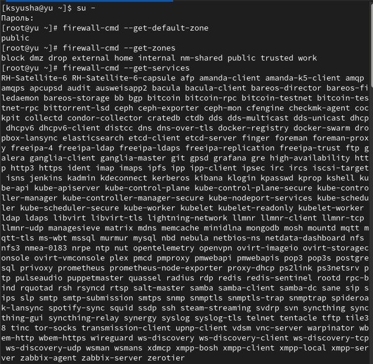
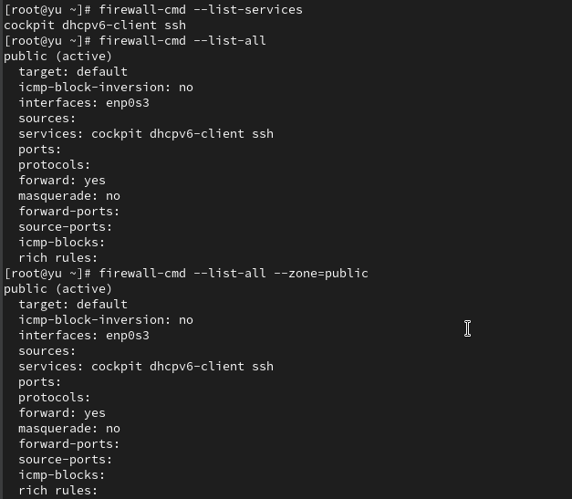
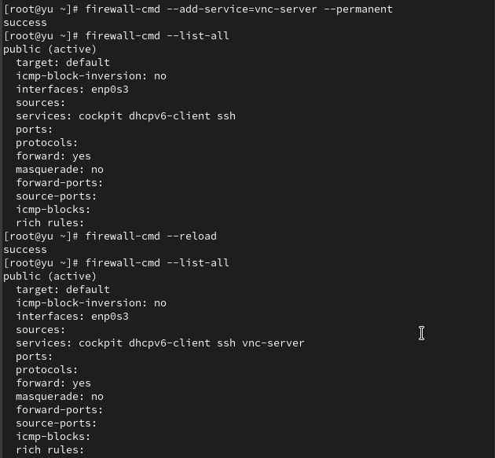
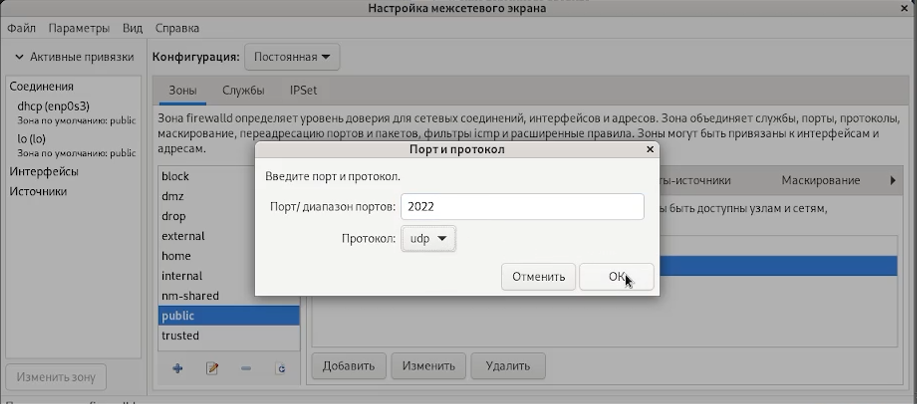

---
## Front matter
title: "Лабораторная работа №13"
subtitle: Фильтр пакетов
author: "Юсупова Ксения Равилевна"

## Generic otions
lang: ru-RU
toc-title: "Содержание"

## Bibliography
bibliography: bib/cite.bib
csl: pandoc/csl/gost-r-7-0-5-2008-numeric.csl

## Pdf output format
toc: true # Table of contents
toc-depth: 2
lof: true # List of figures
lot: true # List of tables
fontsize: 12pt
linestretch: 1.5
papersize: a4
documentclass: scrreprt
## I18n polyglossia
polyglossia-lang:
  name: russian
  options:
	- spelling=modern
	- babelshorthands=true
polyglossia-otherlangs:
  name: english
## I18n babel
babel-lang: russian
babel-otherlangs: english
## Fonts
mainfont: IBM Plex Serif
romanfont: IBM Plex Serif
sansfont: IBM Plex Sans
monofont: IBM Plex Mono
mathfont: STIX Two Math
mainfontoptions: Ligatures=Common,Ligatures=TeX,Scale=0.94
romanfontoptions: Ligatures=Common,Ligatures=TeX,Scale=0.94
sansfontoptions: Ligatures=Common,Ligatures=TeX,Scale=MatchLowercase,Scale=0.94
monofontoptions: Scale=MatchLowercase,Scale=0.94,FakeStretch=0.9
mathfontoptions:
## Biblatex
biblatex: true
biblio-style: "gost-numeric"
biblatexoptions:
  - parentracker=true
  - backend=biber
  - hyperref=auto
  - language=auto
  - autolang=other*
  - citestyle=gost-numeric
## Pandoc-crossref LaTeX customization
figureTitle: "Рис."
tableTitle: "Таблица"
listingTitle: "Листинг"
lofTitle: "Список иллюстраций"
lotTitle: "Список таблиц"
lolTitle: "Листинги"
## Misc options
indent: true
header-includes:
  - \usepackage{indentfirst}
  - \usepackage{float} # keep figures where there are in the text
  - \floatplacement{figure}{H} # keep figures where there are in the text
---

# Цель работы
 
Получить навыки настройки пакетного фильтра в Linux.

# Задание
 
1. Используя firewall-cmd:

– определить текущую зону по умолчанию;

– определить доступные для настройки зоны;

– определить службы, включённые в текущую зону;

– добавить сервер VNC в конфигурацию брандмауэра.

2. Используя firewall-config:

– добавьте службы http и ssh в зону public;

– добавьте порт 2022 протокола UDP в зону public;

– добавьте службу ftp.

3. Выполните задание для самостоятельной работы (раздел 13.5).

# Выполнение лабораторной работы

Получили полномочия администратора, определили текущую зону по умолчанию, доступные зоны и посмотрели службы, доступные на компьютере(рис. [-@fig:001]).

{#fig:001 width=70%}

Определили доступные службы в текущей зонеи сравнили результаты вывода информации при использовании команды firewall-cmd --list-all и команды firewall-cmd --list-all --zone=public (рис. [-@fig:002]).

{#fig:002 width=70%}

Добавили сервер VNC в конфигурацию брандмауэра, проверили, что добавился vnc-server в конфигурацию. Перезапустили службу firewalld и проверили, что vnc-server нет в конфигурации, так как при использовании команды firewall-cmd --add-service=vnc-server без параметра --permanent правило добавляется только в текущую (runtime) конфигурацию брандмауэра, но не сохраняется в постоянную конфигурацию.(рис. [-@fig:003]).

{#fig:003 width=70%}

Добавили службу vnc-server ещё раз, но на этот раз сделали её постоянной и проверили наличие vnc-server в конфигурации. Увидели, что VNC-сервер не указан. Службы, которые были добавлены в конфигурацию на диске, автоматически не добавляются в конфигурацию времени выполнения. Перезагрузилите конфигурацию firewalld и просмотрели конфигурацию времени выполнения(рис. [-@fig:004]).

{#fig:004 width=70%}

Добавили в конфигурацию межсетевого экрана порт 2022 протокола TCP и перезагрузили конфигурацию firewalld. Проверили, что порт добавлен в конфигурацию([рис. @fig:005]).

{#fig:005 width=70%}

Открыли терминал и под учётной записью своего пользователя запустили интерфейс GUI firewall-config. Нажали выпадающее меню рядом с параметром Configuration . Открыли раскрывающийся список и выбрали Permanent . Это позволило сделать постоянными все изменения, которые  вносим при конфигурировании. Выберали зону public и отметили службы http, https и ftp, чтобы включить их.
([рис. @fig:006]).

{#fig:006 width=70%}

Выбрали вкладку Ports и на этой вкладке нажали Add . Ввели порт 2022 и протокол udp, закрыли утилиту firewall-config.([рис. @fig:007]).

{#fig:007 width=70%}

В окне терминала ввели firewall-cmd --list-all. Обратили внимание, что изменения, которые только что внесли, ещё не вступили в силу. Это связано с тем, что настроили их как постоянные изменения, а не как изменения времени выполнения. Перегрузили конфигурацию firewall-cmd и список доступных сервисовe, увидели, что изменения были применены.([рис. @fig:008]).

{#fig:008 width=70%}

# Выполнение самостоятельной работы

Создали в командной строке конфигурацию межсетевого экрана, которая позволяет получить доступ к службе  telnet([рис. @fig:009]).

{#fig:009 width=70%}

Создали в графическом интерфейсе конфигурацию межсетевого экрана, которая позволяет получить доступ для служб imap, pop3, smtp ([рис. @fig:010]).

{#fig:010 width=70%}

Убедились, что конфигурация является постоянной и будет активирована после перезагрузки компьютера.([рис. @fig:011]).

{#fig:011 width=70%}

# Ответы на контрольные вопросы

1. Служба firewalld.service должна быть запущена перед работой с firewall-config, так как этот графический инструмент является фронтендом для управления демоном firewalld.

2. Команда firewall-cmd --add-port=2355/udp добавляет UDP-порт 2355 в текущую зону. Без параметра --permanent изменение будет временным и сбросится после перезагрузки службы.

3. Команда firewall-cmd --list-all-zones показывает полную конфигурацию всех зон, включая службы, порты, протоколы и настройки каждой зоны.

4. Команда firewall-cmd --remove-service=vnc-server удаляет службу vnc-server из текущей конфигурации. Для постоянного удаления нужно добавить параметр --permanent.

5. Команда firewall-cmd --reload активирует постоянную конфигурацию, загружая правила, добавленные с параметром --permanent, без полной перезагрузки службы.

6. Параметр --list-all показывает текущую активную конфигурацию выбранной зоны, позволяя убедиться, что изменения применились и теперь активны.

7. Команда firewall-cmd --zone=public --add-interface=eno1 назначает интерфейс eno1 конкретной зоне public. Для постоянного назначения требуется параметр --permanent.

8. Новый интерфейс автоматически добавляется в зону по умолчанию (обычно public), если не указана конкретная зона. Зону по умолчанию можно проверить командой firewall-cmd --get-default-zone.
   
# Выводы

В ходе лабораторной работы мы получили навыки настройки пакетного фильтра в Linux.

