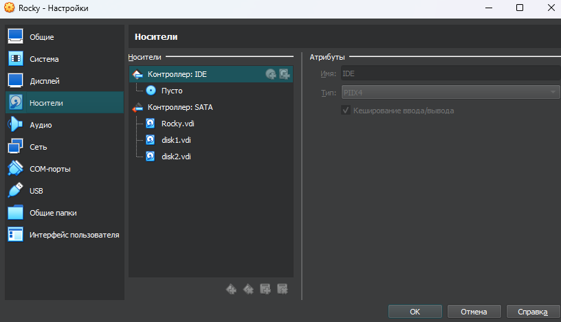
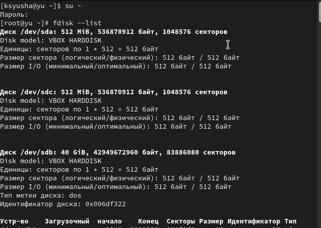
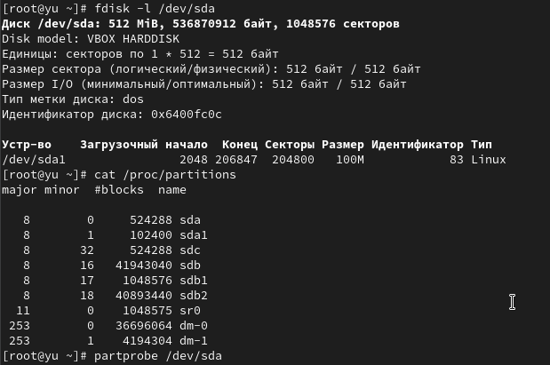
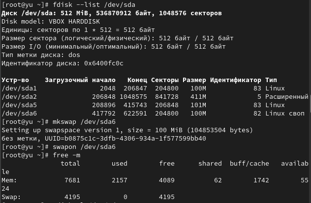
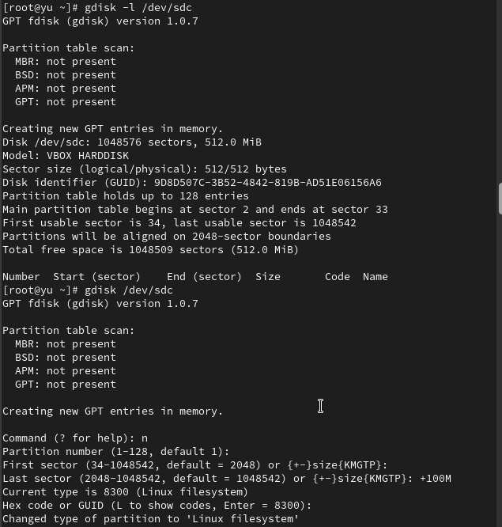
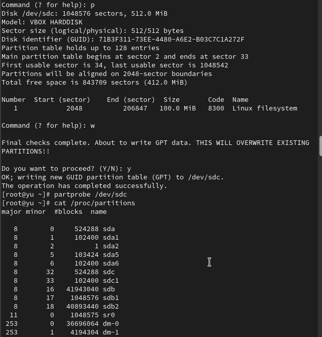
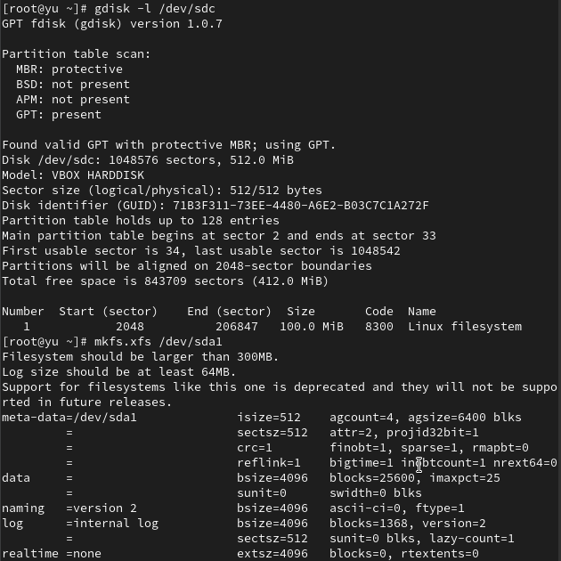
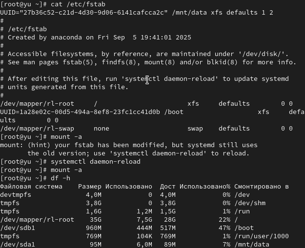
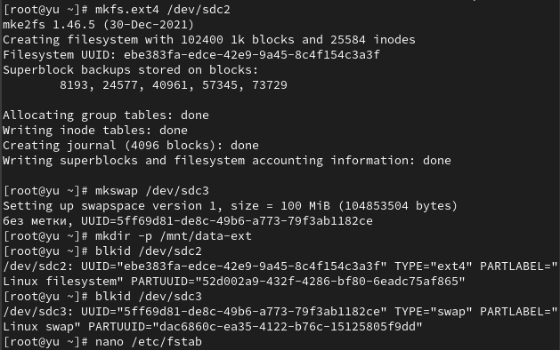
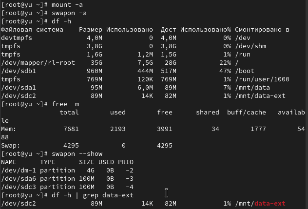

---
## Front matter
lang: ru-RU
title: Лабораторная работа №14
subtitle: Партиции, файловые системы, монтирование
author:
  - Юсупова К. Р.
institute:
  - Российский университет дружбы народов, Москва, Россия

## i18n babel
babel-lang: russian
babel-otherlangs: english

## Formatting pdf
toc: false
toc-title: Содержание
slide_level: 2
aspectratio: 169
section-titles: true
theme: metropolis
header-includes:
 - \metroset{progressbar=frametitle,sectionpage=progressbar,numbering=fraction}
---

# Информация

## Докладчик

:::::::::::::: {.columns align=center}
::: {.column width="70%"}

  * Юсупова Ксения Равилевна
  * Российский университет дружбы народов
  * Номер студенческого билета- 1132247531
  * [1132247531@pfur.ru]

:::
::::::::::::::

# Вводная часть

## Цель работы
 
Получить навыки создания разделов на диске и файловых систем. Получить навыки монтирования файловых систем

# Выполнение лабораторной работы

Добавили к нашей виртуальной машине два диска размером 512 МБ. Для добавления диска в VirtualBox для нашей виртуальной машины нажали в меню Настроить , выбрали Носители , затем на контроллере SATA нажали «Добавить жёсткий диск». В открывшемся окне нажали «Создать образ диска», в следующем окне выбрали VDI и нажмали Далее , затем отметили «Динамический виртуальный жёсткий диск» и нажали Далее , указали месторасположение диска и его название (disk1.vdi или disk2.vdi), а также его размер — 512 МБ, нажали Создать . В окне выбора жёсткого диска встали на обозначение созданного диска и нажали Выбрать . Для добавления второго диска размером 512 МБ к контроллеру SATA повторили указанные выше действия.

{#fig:001 width=30%}

## Выполнение лабораторной работы

Запустили нашу виртуальную машину с добавленными дополнительными дисками disk1 и disk2. В командной строке с полномочиями администратора с помощью fdisk посмотрели перечень разделов на всех имеющихся в системе устройствах жёстких дисков. В списке отразилась информация о добавленных дисках размером 512 MiB, в частности названии разделов: /dev/sdb и /dev/sdc.

{#fig:002 width=40%}

## Выполнение лабораторной работы

Запустили fdisk для работы с диском /dev/sda, получили справку по командам, просмотрели текущее состояние диска командой p.

{#fig:003 width=40%}

## Выполнение лабораторной работы

Приступили к созданию разделов MBR на диске /dev/sda с помощью утилиты fdisk. Создали основной раздел размером 100 MiB, приняв все значения по умолчанию: тип раздела p (основной), номер раздела 1, первый сектор 2048, последний сектор +100M. Приняли тип раздела по умолчанию Linux (83) и записали изменения на диск командой w

{#fig:004 width=40%}

## Выполнение лабораторной работы

Сравнили вывод команды fdisk -l /dev/sda с выводом команды cat /proc/partitions. Команда fdisk показывает подробную информацию о диске и его разделах с указанием типов, начальных и конечных секторов, размеров в понятных единицах, тогда как cat /proc/partitions отображает информацию из памяти ядра в виде сырых данных с указанием major/minor номеров устройств и размеров в блоках. Записали изменения в таблицу разделов ядра командой partprobe /dev/sda.

{#fig:005 width=40%}

## Выполнение лабораторной работы

Вернулись в fdisk для создания логических разделов на том же диске /dev/sda. Создали расширенный раздел, который занял всю оставшуюся часть диска, затем внутри расширенного раздела создали логический раздел размером 101 MiB. Записали изменения и обновили таблицу разделов ядра.

{#fig:006 width=40%}

## Выполнение лабораторной работы

Просмотрели информацию о добавленных разделах через cat /proc/partitions и fdisk --list /dev/sda, убедившись в правильности созданных разделов: /dev/sda1 (основной), /dev/sda2 (расширенный) и /dev/sda5 (логический).

{#fig:007 width=50%}

## Выполнение лабораторной работы

Создали раздел подкачки на диске /dev/sda. Добавили логический раздел размером 100 MiB, изменили его тип на Linux swap (82), записали изменения и обновили таблицу разделов.

{#fig:008 width=40%}

## Выполнение лабораторной работы

Отформатировали раздел подкачки командой mkswap /dev/sda6, активировали его с помощью swapon /dev/sda6 и проверили размер пространства подкачки командой free -m. Проверили, что раздел подкачки создан и активирован: fdisk --list /dev/sda показал наличие раздела /dev/sda6 типа Linux swap, а free -m отобразил увеличенный общий объем swap памяти.

{#fig:009 width=40%}

## Выполнение лабораторной работы

Перешли к работе со вторым добавленным диском /dev/sdc для создания разделов GPT с помощью gdisk. Посмотрели текущее состояние диска командой gdisk -l /dev/sdc, затем запустили gdisk /dev/sdc и создали раздел GPT размером 100 MiB с типом Linux filesystem (8300). Записали изменения и обновили таблицу разделов. 

{#fig:010 width=30%}

## Выполнение лабораторной работы

Проверили создание GPT раздела: gdisk -l /dev/sdc показал наличие раздела /dev/sdc1 размером 100 MiB с типом Linux filesystem, а cat /proc/partitions отобразил соответствующий блок-устройство в системе. 

{#fig:011 width=40%}

## Выполнение лабораторной работы

Выполнили форматирование файловых систем. Для раздела /dev/sda1 создали файловую систему XFS командой mkfs.xfs /dev/sda1 и установили метку файловой системы "xfsdisk" с помощью xfs_admin -L xfsdisk /dev/sda1. Для раздела /dev/sda5 создали файловую систему EXT4 командой mkfs.ext4 /dev/sda5, установили метку "ext4disk" через tune2fs -L ext4disk /dev/sda5 и настроили параметры монтирования по умолчанию с включением списков контроля доступа и расширенных атрибутов пользователя

{#fig:012 width=30%}

## Выполнение лабораторной работы

Выполнили ручное монтирование файловых систем. Создали точку монтирования /mnt/tmp и смонтировали раздел /dev/sda5 командой mount /dev/sda5 /mnt/tmp. Проверили корректность монтирования через команду mount, которая показала наличие смонтированного раздела. Затем отмонтировали раздел командой umount /dev/sda5 и снова проверили командой mount, убедившись, что раздел успешно отмонтирован

{#fig:013 width=30%}

## Выполнение лабораторной работы

Настроили автоматическое монтирование раздела XFS через /etc/fstab. Создали точку монтирования /mnt/data, определили UUID раздела /dev/sda1 командой blkid /dev/sda1, отредактировали файл /etc/fstab, добавив строку с UUID раздела, точкой монтирования /mnt/data и типом файловой системы xfs. 

{#fig:014 width=50%}

## Выполнение лабораторной работы

Проверили содержимое файла /etc/fstab, убедившись в правильности добавленной записи для автоматического монтирования раздела /dev/sda1 в /mnt/data при загрузке системы. 

{#fig:015 width=70%}

## Выполнение лабораторной работы

Применили изменения командой mount -a и проверили монтирование через df -h. Проверили корректность монтирования через /etc/fstab: выполнили mount -a, затем systemctl daemon-reload для обновления systemd, снова mount -a, и df -h показал, что раздел /dev/sda1 успешно смонтирован в /mnt/data.

{#fig:016 width=50%}

# Выполнение самостоятельной работы

Добавили две партации на диск с разбиением GPT (/dev/sdc). Запсутили gdisk /dev/sdc, создали раздел номер 2 размером 100 MiB с типом Linux filesystem (8300) и раздел номер 3 размером 100 Mib c типом Linux swap (8200). Записали изменеия и обновили таблицу разделов 

{#fig:017 width=50%}

## Выполнение самостоятельной работы

Проверили созданные разделы: gdisk -l /dev/sdc показал наличие трех разделов /dev/sdc1 (100MiB, Linux filesystem), /dev/sdc2 (100MiB, Linux filesystem) и  /dev/sdc3 (100MiB, Linux swap).Cat /proc/partitions отобразил соответствующие блочные устройства в системе

{#fig:018 width=40%}

## Выполнение самостоятельной работы

Отформатировали созданные разделы: для /dev/sdc2 создали файловую систему ext4 командой mkfs.ext4 /dev/sdc2, для /dev/sdc3 создали раздел подкачки командой  mkswap /dev/sdc3. Создали точку монтирования /mnt/data-ext и определили UUID разделов с помощью blkid.

{#fig:019 width=50%}

## Выполнение самостоятельной работы

Настроили сервер для автоматического монтирования разделов. Отредактирован файл /etc/fstab, добавив строки для автомтического монтирования раздела ext4 в /mnt/data-ext и активации раздела подкачки при заграке системы 

{#fig:020 width=50%}

## Выполнение самостоятельной работы

Применили настройки из /etc/fstab командой mount -a, активировали раздел подкачки  командой swapon -a. Проверили после перезагрузки системы, что раздел ext4 смонтирован в /mnt/data-ext , раздел подкачки активирован и общий объём памяти увеличен на 100 MiB

{#fig:021 width=50%}

# Выводы

В ходе лабораторной работы мы получили навыки создания разделов на диске и файловых систем; а также получили навыки монтирования файловых систем.

