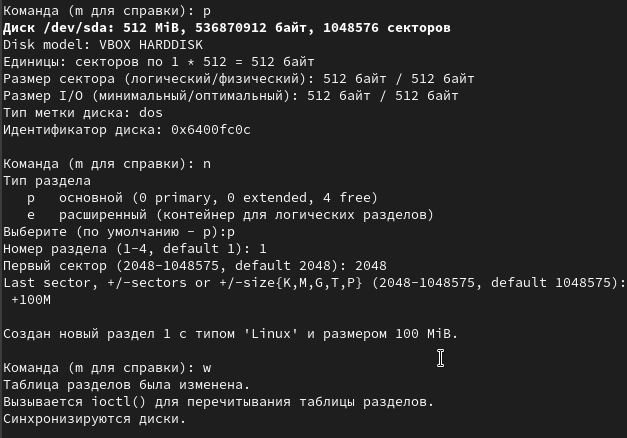
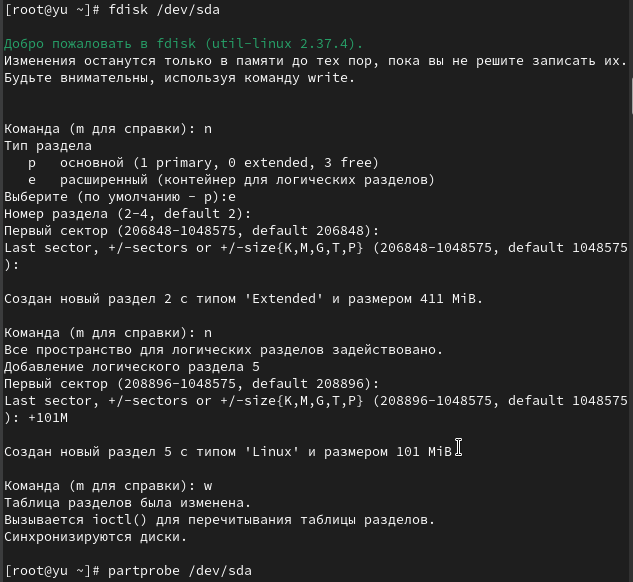
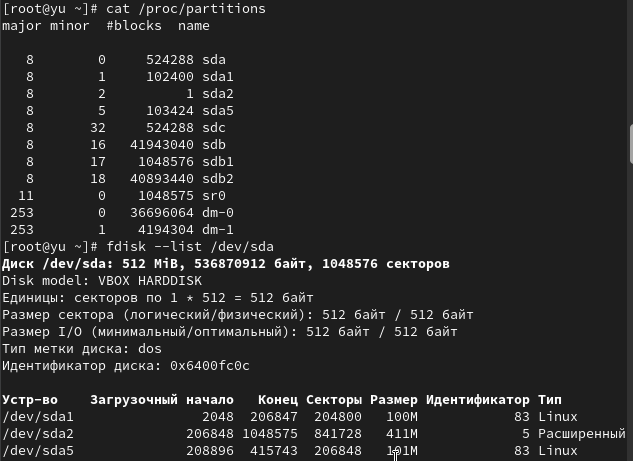
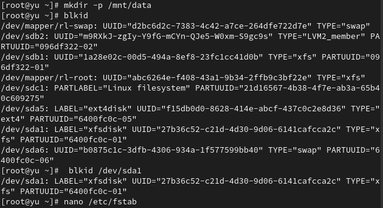
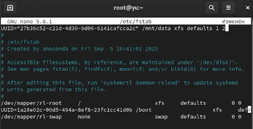
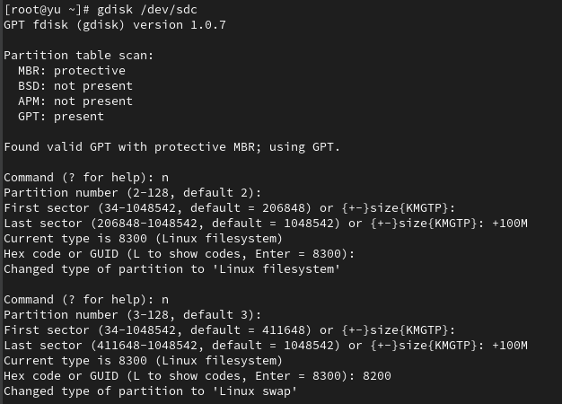
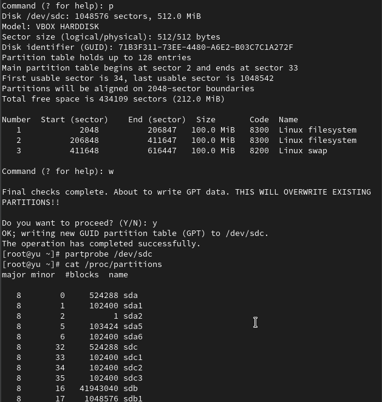
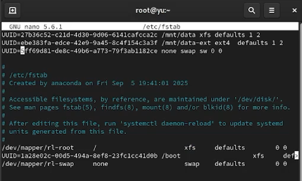

---
## Front matter
title: "Лабораторная работа №14"
subtitle: Партиции, файловые системы, монтирование
author: "Юсупова Ксения Равилевна"

## Generic otions
lang: ru-RU
toc-title: "Содержание"

## Bibliography
bibliography: bib/cite.bib
csl: pandoc/csl/gost-r-7-0-5-2008-numeric.csl

## Pdf output format
toc: true # Table of contents
toc-depth: 2
lof: true # List of figures
lot: true # List of tables
fontsize: 12pt
linestretch: 1.5
papersize: a4
documentclass: scrreprt
## I18n polyglossia
polyglossia-lang:
  name: russian
  options:
	- spelling=modern
	- babelshorthands=true
polyglossia-otherlangs:
  name: english
## I18n babel
babel-lang: russian
babel-otherlangs: english
## Fonts
mainfont: IBM Plex Serif
romanfont: IBM Plex Serif
sansfont: IBM Plex Sans
monofont: IBM Plex Mono
mathfont: STIX Two Math
mainfontoptions: Ligatures=Common,Ligatures=TeX,Scale=0.94
romanfontoptions: Ligatures=Common,Ligatures=TeX,Scale=0.94
sansfontoptions: Ligatures=Common,Ligatures=TeX,Scale=MatchLowercase,Scale=0.94
monofontoptions: Scale=MatchLowercase,Scale=0.94,FakeStretch=0.9
mathfontoptions:
## Biblatex
biblatex: true
biblio-style: "gost-numeric"
biblatexoptions:
  - parentracker=true
  - backend=biber
  - hyperref=auto
  - language=auto
  - autolang=other*
  - citestyle=gost-numeric
## Pandoc-crossref LaTeX customization
figureTitle: "Рис."
tableTitle: "Таблица"
listingTitle: "Листинг"
lofTitle: "Список иллюстраций"
lotTitle: "Список таблиц"
lolTitle: "Листинги"
## Misc options
indent: true
header-includes:
  - \usepackage{indentfirst}
  - \usepackage{float} # keep figures where there are in the text
  - \floatplacement{figure}{H} # keep figures where there are in the text
---

# Цель работы
 
Получить навыки создания разделов на диске и файловых систем. Получить навыки монтирования файловых систем

# Задание
 
1. Добавьте два диска на виртуальной машине (раздел 14.4.1).

2. Продемонстрируйте навыки создания разделов MBR с помощью fdisk (раздел 14.4.2).

3. Продемонстрируйте навыки создания логических разделов с помощью fdisk (раздел 14.4.3).

4. Продемонстрируйте навыки создания раздела подкачки с помощью fdisk (раздел 14.4.4).

5. Продемонстрируйте навыки создания разделов GPT с помощью gdisk (раздел 14.4.5).

6. Продемонстрируйте навыки форматирования файловой системы XFS (раздел 14.4.6).

7. Продемонстрируйте навыки форматирования файловой системы EXT4 (раздел 14.4.7).

8. Продемонстрируйте навыки ручного монтирования файловых систем (раздел 14.4.8).

9. Продемонстрируйте навыки монтирования файловых систем с помощью /etc/fstab (раздел 14.4.9).

10. Выполните задание для самостоятельной работы (раздел 14.5).

# Выполнение лабораторной работы

Добавили к нашей виртуальной машине два диска размером 512 МБ. Для добавления диска в VirtualBox для нашей виртуальной машины нажали в меню Настроить , выбрали Носители , затем на контроллере SATA нажали «Добавить жёсткий диск». В открывшемся окне нажали «Создать образ диска», в следующем окне выбрали VDI и нажмали Далее , затем отметили «Динамический виртуальный жёсткий диск» и нажали Далее , указали месторасположение диска и его название (disk1.vdi или disk2.vdi), а также его размер — 512 МБ, нажали Создать . В окне выбора жёсткого диска встали на обозначение созданного диска и нажали Выбрать . Для добавления второго диска размером 512 МБ к контроллеру SATA повторили указанные выше действия.(рис. [-@fig:001]).

{#fig:001 width=70%}

Запустили нашу виртуальную машину с добавленными дополнительными дисками disk1 и disk2. В командной строке с полномочиями администратора с помощью fdisk посмотрели перечень разделов на всех имеющихся в системе устройствах жёстких дисков. В списке отразилась информация о добавленных дисках размером 512 MiB, в частности названии разделов: /dev/sdb и /dev/sdc.(рис. [-@fig:002]).

{#fig:002 width=70%}

Запустили fdisk для работы с диском /dev/sda, получили справку по командам, просмотрели текущее состояние диска командой p. ([рис. @fig:003]).

{#fig:003 width=70%}

Приступили к созданию разделов MBR на диске /dev/sda с помощью утилиты fdisk. Создали основной раздел размером 100 MiB, приняв все значения по умолчанию: тип раздела p (основной), номер раздела 1, первый сектор 2048, последний сектор +100M. Приняли тип раздела по умолчанию Linux (83) и записали изменения на диск командой w. ([рис. @fig:004]).

{#fig:004 width=70%}

Сравнили вывод команды fdisk -l /dev/sda с выводом команды cat /proc/partitions. Команда fdisk показывает подробную информацию о диске и его разделах с указанием типов, начальных и конечных секторов, размеров в понятных единицах, тогда как cat /proc/partitions отображает информацию из памяти ядра в виде сырых данных с указанием major/minor номеров устройств и размеров в блоках. Записали изменения в таблицу разделов ядра командой partprobe /dev/sda. ([рис. @fig:005]).

{#fig:005 width=70%}

Вернулись в fdisk для создания логических разделов на том же диске /dev/sda. Создали расширенный раздел, который занял всю оставшуюся часть диска, затем внутри расширенного раздела создали логический раздел размером 101 MiB. Записали изменения и обновили таблицу разделов ядра. ([рис. @fig:006]).

{#fig:006 width=70%}

Просмотрели информацию о добавленных разделах через cat /proc/partitions и fdisk --list /dev/sda, убедившись в правильности созданных разделов: /dev/sda1 (основной), /dev/sda2 (расширенный) и /dev/sda5 (логический). ([рис. @fig:007]).

{#fig:007 width=70%}

Создали раздел подкачки на диске /dev/sda. Добавили логический раздел размером 100 MiB, изменили его тип на Linux swap (82), записали изменения и обновили таблицу разделов. ([рис. @fig:008]).

{#fig:008 width=70%}

Отформатировали раздел подкачки командой mkswap /dev/sda6, активировали его с помощью swapon /dev/sda6 и проверили размер пространства подкачки командой free -m. Проверили, что раздел подкачки создан и активирован: fdisk --list /dev/sda показал наличие раздела /dev/sda6 типа Linux swap, а free -m отобразил увеличенный общий объем swap памяти. ([рис. @fig:009]).

{#fig:009 width=70%}

Перешли к работе со вторым добавленным диском /dev/sdc для создания разделов GPT с помощью gdisk. Посмотрели текущее состояние диска командой gdisk -l /dev/sdc, затем запустили gdisk /dev/sdc и создали раздел GPT размером 100 MiB с типом Linux filesystem (8300). Записали изменения и обновили таблицу разделов. ([рис. @fig:010]).

{#fig:010 width=70%}

Проверили создание GPT раздела: gdisk -l /dev/sdc показал наличие раздела /dev/sdc1 размером 100 MiB с типом Linux filesystem, а cat /proc/partitions отобразил соответствующий блок-устройство в системе. ([рис. @fig:011]).

{#fig:011 width=70%}

Выполнили форматирование файловых систем. Для раздела /dev/sda1 создали файловую систему XFS командой mkfs.xfs /dev/sda1 и установили метку файловой системы "xfsdisk" с помощью xfs_admin -L xfsdisk /dev/sda1. Для раздела /dev/sda5 создали файловую систему EXT4 командой mkfs.ext4 /dev/sda5, установили метку "ext4disk" через tune2fs -L ext4disk /dev/sda5 и настроили параметры монтирования по умолчанию с включением списков контроля доступа и расширенных атрибутов пользователя. ([рис. @fig:012]).

{#fig:012 width=70%}

Выполнили ручное монтирование файловых систем. Создали точку монтирования /mnt/tmp и смонтировали раздел /dev/sda5 командой mount /dev/sda5 /mnt/tmp. Проверили корректность монтирования через команду mount, которая показала наличие смонтированного раздела. Затем отмонтировали раздел командой umount /dev/sda5 и снова проверили командой mount, убедившись, что раздел успешно отмонтирован. ([рис. @fig:013]).

{#fig:013 width=70%}

Настроили автоматическое монтирование раздела XFS через /etc/fstab. Создали точку монтирования /mnt/data, определили UUID раздела /dev/sda1 командой blkid /dev/sda1, отредактировали файл /etc/fstab, добавив строку с UUID раздела, точкой монтирования /mnt/data и типом файловой системы xfs. ([рис. @fig:014]).

{#fig:014 width=70%}

Проверили содержимое файла /etc/fstab, убедившись в правильности добавленной записи для автоматического монтирования раздела /dev/sda1 в /mnt/data при загрузке системы. ([рис. @fig:015]).

{#fig:015 width=70%}

Применили изменения командой mount -a и проверили монтирование через df -h. Проверили корректность монтирования через /etc/fstab: выполнили mount -a, затем systemctl daemon-reload для обновления systemd, снова mount -a, и df -h показал, что раздел /dev/sda1 успешно смонтирован в /mnt/data. ([рис. @fig:016]).

{#fig:016 width=70%}

# Выполнение самостоятельной работы

Добавили две партации на диск с разбиением GPT (/dev/sdc). Запсутили gdisk /dev/sdc, создали раздел номер 2 размером 100 MiB с типом Linux filesystem (8300) и раздел номер 3 размером 100 Mib c типом Linux swap (8200). Записали изменеия и обновили таблицу разделов ([рис. @fig:017]).

{#fig:017 width=70%}

Проверили созданные разделы: gdisk -l /dev/sdc показал наличие трех разделов /dev/sdc1 (100MiB, Linux filesystem), /dev/sdc2 (100MiB, Linux filesystem) и  /dev/sdc3 (100MiB, Linux swap).Cat /proc/partitions отобразил соответствующие блочные устройства в системе ([рис. @fig:018]).

{#fig:018 width=70%}

Отформатировали созданные разделы: для /dev/sdc2 создали файловую систему ext4 командой mkfs.ext4 /dev/sdc2, для /dev/sdc3 создали раздел подкачки командой  mkswap /dev/sdc3. Создали точку монтирования /mnt/data-ext и определили UUID разделов с помощью blkid.([рис. @fig:019]).

{#fig:019 width=70%}

Настроили сервер для автоматического монтирования разделов. Отредактирован файл /etc/fstab, добавив строки для автомтического монтирования раздела ext4 в /mnt/data-ext и активации раздела подкачки при заграке системы ([рис. @fig:020]).

{#fig:020 width=70%}

Применили настройки из /etc/fstab командой mount -a, активировали раздел подкачки  командой swapon -a. Проверили после перезагрузки системы, что раздел ext4 смонтирован в /mnt/data-ext , раздел подкачки активирован и общий объём памяти увеличен на 100 MiB([рис. @fig:021]).

{#fig:021 width=70%}

# Ответы на контрольные вопросы

1. Какой инструмент используется для создания разделов GUID?

   Для создания разделов GPT (GUID Partition Table) используется инструмент `gdisk`. В ходе лабораторной работы мы использовали команду `gdisk /dev/sdc` для создания разделов GPT на втором добавленном диске.

2. Какой инструмент применяется для создания разделов MBR?

   Для создания разделов MBR (Master Boot Record) применяется инструмент `fdisk`. В лабораторной работе мы использовали команду `fdisk /dev/sda` для создания разделов MBR на первом добавленном диске.

3. Какой файл используется для автоматического монтирования разделов во время загрузки?

   Для автоматического монтирования разделов во время загрузки используется файл `/etc/fstab`. В ходе работы мы редактировали этот файл, добавляя строки для автоматического монтирования разделов `/dev/sda1` в `/mnt/data` и `/dev/sdc2` в `/mnt/data-ext`.

4. Какой вариант монтирования целесообразно выбрать, если необходимо, чтобы файловая система не была автоматически примонтирована во время загрузки?

   Если необходимо, чтобы файловая система не монтировалась автоматически при загрузке, следует использовать ручное монтирование командой `mount`. В лабораторной работе мы выполняли ручное монтирование раздела `/dev/sda5` в `/mnt/tmp` командой `mount /dev/sda5 /mnt/tmp`.

5. Какая команда позволяет форматировать раздел с типом 82 с соответствующей файловой системой?

   Для форматирования раздела с типом 82 (Linux swap) используется команда `mkswap`. В работе мы форматировали разделы подкачки командами `mkswap /dev/sda6` и `mkswap /dev/sdc3`.

6. Вы только что добавили несколько разделов для автоматического монтирования при загрузке. Как можно безопасно проверить, будет ли это работать без реальной перезагрузки?

   Для безопасной проверки автоматического монтирования без перезагрузки используется команда `mount -a`, которая монтирует все файловые системы, указанные в `/etc/fstab`. В работе мы использовали эту команду для проверки корректности настроек.

7. Какая файловая система создаётся, если вы используете команду mkfs без какой-либо спецификации файловой системы?

   Команда `mkfs` без спецификации файловой системы по умолчанию создаёт файловую систему ext2. Однако в современных дистрибутивах рекомендуется явно указывать тип файловой системы.

8. Как форматировать раздел EXT4?

   Для форматирования раздела в файловую систему EXT4 используется команда `mkfs.ext4`. В лабораторной работе мы форматировали разделы командами `mkfs.ext4 /dev/sda5` и `mkfs.ext4 /dev/sdc2`.

9. Как найти UUID для всех устройств на компьютере?

   Для поиска UUID всех устройств на компьютере используется команда `blkid`. В ходе работы мы использовали эту команду для получения UUID разделов перед добавлением записей в `/etc/fstab`.
   
# Выводы

В ходе лабораторной работы мы получили навыки создания разделов на диске и файловых систем, получили навыки монтирования файловых систем.

